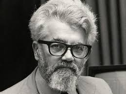
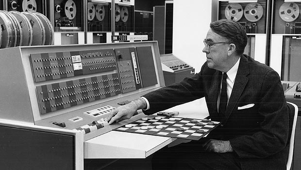

# Artificial Intelligence, Machine Learning and Deep Learning

You can think of deep learning, machine learning and artificial intelligence as a set of Russian dolls nested within each other, beginning with the smallest and working out. Deep learning is a subset of machine learning, and machine learning is a subset of AI, which is an umbrella term for any computer program that does something smart. In other words, all machine learning is AI, but not all AI is machine learning, and so forth. 

## Artificial Intelligence



John McCarthy, widely recognized as one of the godfathers of AI, defined it as "[the science and engineering of making intelligent machines](http://www-formal.stanford.edu/jmc/whatisai/node1.html)."

Here are a few definitions of artificial intelligence:

* A branch of computer science dealing with the simulation of intelligent behavior in computers.
* The capability of a machine to imitate intelligent human behavior.
* A computer system able to perform tasks that normally require human intelligence, such as visual perception, speech recognition, decision-making, and translation between languages.

There are a lot of ways to simulate human intelligence, and some methods are more intelligence than others. 

AI can be a pile of if-then statements, or a complex statistical model. The if-then statements are simply rules explicitly programmed by a human hand. Taken together, these if-then statements are sometimes called rules engines or expert systems. The intelligence they might mimic could be an accountant with knowledge of the tax code, who takes information you feed it, runs the information through a set of static rules, and gives your the amount of taxes you owe as a result. 

Usually, when a computer program designed by AI researchers actually succeeds at something -- like winning at chess -- many people say it's "not really intelligent", because the algorithm's internals are well understood. So you could say that true AI is whatever computers can't do yet. ;)

## Machine Learning 

Machine learning is a subset of AI. That is, all machine learning counts as AI, but not all AI counts as machine learning. For example, symbolic logic -- rules engines, expert systems and knowledge graphs -- could all be described as AI, and none of them are machine learning. 

One aspect that separates machine *learning* from the knowledge graphs and expert systems is its ability to modify itself when exposed to more data; i.e. machine learning is dynamic and does not require human intervention to make certain changes. That makes it less brittle, and less reliant on human experts.

```
"A computer program is said to learn from experience E with respect to some class of tasks T and performance measure P if its performance at tasks in T, as measured by P, improves with experience E." --Tom Mitchell
```



In 1959, Arthur Samuel, one of the pioneers of machine learning, defined machine learning as a "field of study that gives computers the ability to learn without being explicitly programmed." That is, machine-learning programs have not been explicitly entered into a computer, like the if-then statements above. Machine-learning programs, in a sense, adjust themselves in response to the data they're exposed to. 

Samuel taught a computer program to play checkers. His goal was to teach it to play checkers better than himself, which is obviously not something he could program explicitly. He succeeded, and in 1962 his program beat the checkers champion of the state of Connecticut. 

<p align="center">
<a href="https://skymind.ai/quickstart" type="button" class="btn btn-lg btn-success" onClick="ga('send', 'event', ‘quickstart', 'click');">GET STARTED WITH DEEP LEARNING</a>
</p>

The "learning" part of machine learning means that ML algorithms attempt to optimize along a certain dimension; i.e. they usually try to minimize error or maximize the likelihood of their predictions being true. This has three names: an error function, a loss function, or an objective function, because the algorithm has an objective... When someone says they are working with a machine-learning algorithm, you can get to the gist of its value by asking: What's the objective function?

How does one minimize error? Well, one way is to build a framework that multiplies inputs in order to make guesses as to the inputs' nature. Different outputs/guesses are the product of the inputs and the algorithm. Usually, the initial guesses are quite wrong, and if you are lucky enough to have ground-truth labels pertaining to the input, you can measure how wrong your guesses are by contrasting them with the truth, and then use that error to modify your algorithm. That's what neural networks do. They keep on measuring the error and modifying their parameters until they can't achieve any less error.

They are, in short, an optimization algorithm. If you tune them right, they minimize their error by guessing and guessing and guessing again.

## Deep Learning

Deep learning is a subset of machine learning. Usually, when people use the term deep learning, they are referring to [deep artificial neural networks](https://deeplearning4j.org/neuralnet-overview), and somewhat less frequently to deep [reinforcement learning](https://deeplearning4j.org/reinforcementlearning). 

Deep artificial neural networks are a set of algorithms that have set new records in accuracy for many important problems, such as image recognition, sound recognition, recommender systems, etc. For example, deep learning is part of DeepMind's well-known AlphaGo algorithm, which beat the former world champion Lee Sedol at Go in early 2016, and the current world champion Ke Jie in early 2017. A more complete explanation of neural works is [here](./neuralnet-overview).

<p align="center">
<a href="https://skymind.ai/quickstart" type="button" class="btn btn-lg btn-success" onClick="ga('send', 'event', ‘quickstart', 'click');">GET STARTED WITH DEEP LEARNING</a>
</p>

*Deep* is a technical term. It refers to the number of layers in a neural network. A shallow network has one so-called *hidden layer*, and a deep network has more than one. Multiple hidden layers allow deep neural networks to learn features of the data in a so-called feature hierarchy, because simple features (e.g. two pixels) recombine from one layer to the next, to form more complex features (e.g. a line). Nets with many layers pass input data (features) through more mathematical operations than nets with few layers, and are therefore more computationally intensive to train. Computational intensivity is one of the hallmarks of deep learning, and it is one reason why GPUs are in demand to train deep-learning models. 

So you could apply the same definition to deep learning that Arthur Samuel did to machine learning -- a "field of study that gives computers the ability to learn without being explicitly programmed" -- while adding that it tends to result in higher accuracy, require more hardware or training time, and perform exceptionally well on machine perception tasks that involved unstructured data such as blobs of pixels or text.  

### <a name="beginner">Other Deeplearning4j Tutorials</a>
* [Introduction to Neural Networks](./neuralnet-overview)
* [Word2Vec: Neural Embeddings for Java](./word2vec)
* [Restricted Boltzmann Machines](./restrictedboltzmannmachine)
* [Eigenvectors, Covariance, PCA and Entropy](./eigenvector)
* [LSTMs & Recurrent Networks](./lstm)
* [Neural Networks & Regression](./logistic-regression)
* [Convolutional Networks (CNNs)](./convolutionalnets)
* [Generative Adversarial Networks (GANs)](./generative-adversarial-network)
