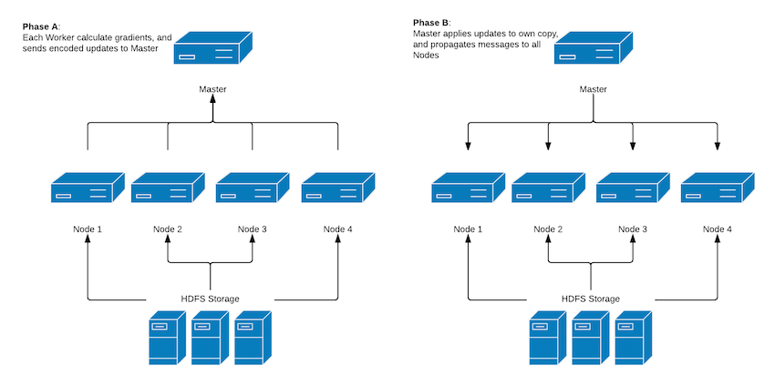

# Distributed training: gradients sharing

As of release 0.9.0 (or the 0.8.1-SNAPSHOT), DeepLearning4j also supports distributed training in Apache Spark environment, using Aeron for messages.

Idea is relatively simple: individual workers are processing DataSets, and before gradients are applied to weights, they are accumulated in the intermediate storage, and only values above some threshold are propagated as weights updates across the network.
 


Link to paper: [http://nikkostrom.com/publications/interspeech2015/strom_interspeech2015.pdf](http://nikkostrom.com/publications/interspeech2015/strom_interspeech2015.pdf)


# Setting up your cluster
Basically all you need to run training is Spark 1.x/2.x cluster, and at least one open UDP port (both inbound/outbound)

Example configuration:
```
SparkConf sparkConf = new SparkConf();
sparkConf.setAppName("DL4J Spark Example");
JavaSparkContext sc = new JavaSparkContext(sparkConf);

MultiLayerConfiguration conf = new NeuralNetConfiguration.Builder()
            .seed(12345)
            .optimizationAlgo(OptimizationAlgorithm.STOCHASTIC_GRADIENT_DESCENT)
            .iterations(1)
            ...
            .build();
        
VoidConfiguration voidConfiguration = VoidConfiguration.builder()
            .unicastPort(40123)
            .build();

TrainingMaster tm = new SharedTrainingMaster.Builder(voidConfiguration,batchSizePerWorker)
            .updatesThreshold(1e-3)
            .rddTrainingApproach(RDDTrainingApproach.Exported)
            .batchSizePerWorker(batchSizePerWorker)
            .workersPerNode(4)
            .build();

//Create the Spark network
SparkDl4jMultiLayer sparkNet = new SparkDl4jMultiLayer(sc, conf, tm);

//Execute training:
for (int i = 0; i < numEpochs; i++) {
    sparkNet.fit(trainData);
    log.info("Completed Epoch {}", i);
}
```
**_PLEASE NOTE_**: this configuration assumes that you have UDP port 40123 open on ALL nodes within your cluster.


# Effective scalability
Network IO has its own price, and this algorithm does some IO as well. Additional overhead to training time can be calculated as `updates encoding time + message serialization time + updates application from other workers`.
So, the longer original iteration time is, less your relative impact coming from sharing is, and better hypothetical scalability you'll be able to get.

Here's simple form, that'll help you with scalability expectations:


# Performance hints

### Encoding threshold
Higher threshold value gives you more sparse updates, so will boost network IO performance, but might (and probably will) affect learning performance of your neural network.
Lower threshold value will give you more dense updates, so each individual updates message will become larger, so will degrade network IO performance. Individual "best threshold value" is impossible to predict, since it may vary for different architectures. But default value of `1e-3` is a good value to start with.

### Network latency vs bandwidth
Rule of thumb is simple here: faster your network is - better performance you'll get. 1GBe network should be considered absolute minimum these days. But 10GBe will suit better, due to lower latency.

### UDP Unicast vs UDP Broadcast
One might thought that UDP Broadcast transfers should be faster, but for training performance it matters only for small workloads, and here's why. 
By design each worker sends 1 updates message per iteration, and this fact won't change regardless of UDP transport type. Since messages retransmission in UDP Unicast transport is handled by Master node, which isn't really that busy anyway.

### Multi-GPU environments
Best results are to be expected on boxes with PCIe/NVLink P2P connectivity between devices available. However, everything will still work fine even without P2P. Just "a bit" slower :)