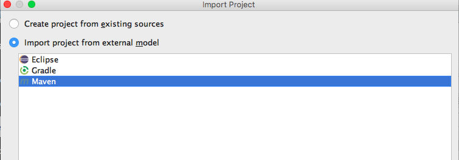
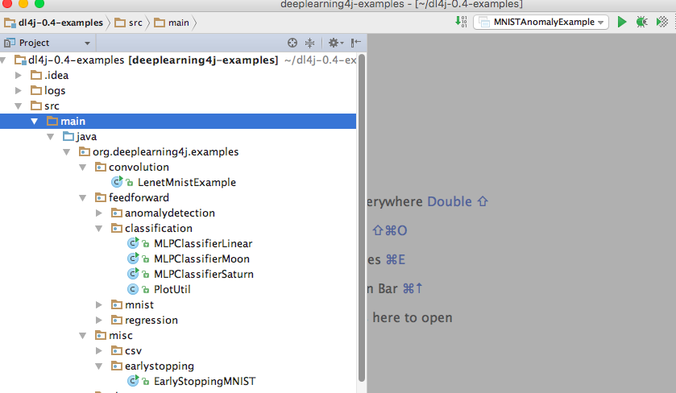
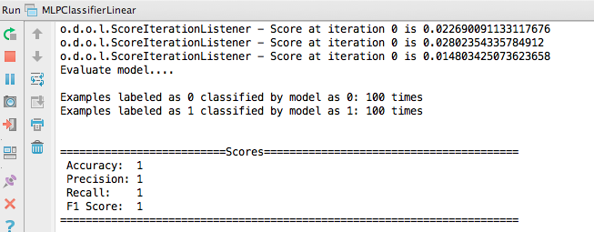
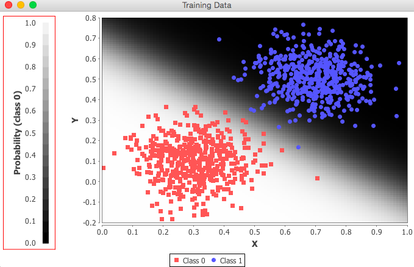

<!-- Begin Inspectlet Embed Code -->
<script type="text/javascript" id="inspectletjs">
window.__insp = window.__insp || [];
__insp.push(['wid', 1755897264]);
(function() {
function ldinsp(){if(typeof window.__inspld != "undefined") return; window.__inspld = 1; var insp = document.createElement('script'); insp.type = 'text/javascript'; insp.async = true; insp.id = "inspsync"; insp.src = ('https:' == document.location.protocol ? 'https' : 'http') + '://cdn.inspectlet.com/inspectlet.js'; var x = document.getElementsByTagName('script')[0]; x.parentNode.insertBefore(insp, x); };
setTimeout(ldinsp, 500); document.readyState != "complete" ? (window.attachEvent ? window.attachEvent('onload', ldinsp) : window.addEventListener('load', ldinsp, false)) : ldinsp();
})();
</script>
<!-- End Inspectlet Embed Code -->

# Gu&iacute;a de inicio r&aacute;pido

Esto es todo lo que tiene que saber para ejecutar los ejemplos de DL4J y empezar sus propios proyectos.

Le recomendamos unirse a nuestro [chat en vivo de Gitter](https://gitter.im/deeplearning4j/deeplearning4j). Gitter es el sitio donde puede pedir ayuda y hacer comentarios, pero por favor use esta gu&iacute;a antes de hacer preguntas que ya hemos respondido anteriormente. Si es nuevo en deep learning, hemos incluido [una hoja de ruta para principiantes](../deeplearningforbeginners.html) con enlaces a cursos, lecturas y otros recursos. Si necestia un tutorial de principio a fin para comenzar (incluida la configuraci&oacute;n), por favor vaya a nuestra p&aacute;gina [primeros pasos](http://deeplearning4j.org/gettingstarted).

### Una Muestra de C&oacute;digo

Deeplearning4j es un lenguaje espec&iacute;fico de dominio para configurar redes neuronales, que est&aacute;n hechas de m&uacute;ltiples capas. Todo empieza con un `MultiLayerConfiguration`, que organiza esas capas y sus hiperpar&aacute;metros.

Los hiperpar&aacute;metros son variables que determinan c&oacute;mo una red neuronal aprende. Incluyen cu&aacute;ntas veces se actualizan los pesos del modelo, 
c&oacute;mo inicializar dichos pesos, qu&eacute; funci&oacute;n de activaci&oacute;n utilizar en los nodos, qu&eacute; algoritmo de optimizaci&oacute;n utilizar y c&oacute;mo de r&aacute;pido el modelo deber&iacute;a aprender. Esta es c&oacute;mo una configuraci&oacute;n deber&iacute;a verse:

``` java
    MultiLayerConfiguration conf = new NeuralNetConfiguration.Builder()
        .iterations(1)
        .weightInit(WeightInit.XAVIER)
        .activation("relu")
        .optimizationAlgo(OptimizationAlgorithm.STOCHASTIC_GRADIENT_DESCENT)
        .learningRate(0.05)
        // ... other hyperparameters
        .list()
        .backprop(true)
        .build();
```

Con Deeplearning4j, puede a&ntilde;adir una capa llamanado a `layer` en el `NeuralNetConfiguration.Builder()`, especificando su lugar en el orden de capas (la capa de debajo con &iacute;ndice cero  es la capa de entra), el n&uacute;mero de nodos de entrada y salida, `nIn` y `nOut`, as&iacute; como el tipo: `DenseLayer`.

``` java
        .layer(0, new DenseLayer.Builder().nIn(784).nOut(250)
                .build())
```

Una vez que haya configurado su red, puede entrenar el model con `model.fit`.

## Prerequisitos

* [Java (versi&oacute;n desarrollador)](#Java) 1.7 o posterior (**S&oacute;lo la versi&oacute;n de 64-Bit est&aacute; soportad**)
* [Apache Maven](#Maven) (gestor automatizado de construcci&oacute;n y dependencias)
* [IntelliJ IDEA](#IntelliJ) o Eclipse
* [Git](#Git)

Deber&iacute;a tener todo esto instalado para usar la gu&iacute;a de inicio r&aacute;pida. DL4J est&aacute; orientada a desarrolladores profesionales de Java que est&eacute;n familiarizados con despliegues en producci&oacute;n, IDEs y herramientas automatizadas de construcci&oacute;n. Trabajar con DL4J ser&aacute; m&aacute;s sencillo si ya tiene experiencia con ellos.

Si es nuevo en Java o no est&aacute; familiarizado con estas herramientas, lea los detalles siguientes que le ayudar&aacute;n con la instalaci&oacute;n y configuraci&oacute;n. En caso contrario, **salte a <a href="#examples">los ejemplos de DL4J</a>**.

#### <a name="Java">Java</a>

Si no tiene Java 1.7 o posterior, descargue el [Java Development Kit (JDK) m&aacute;s actual aquí](http://www.oracle.com/technetwork/java/javase/downloads/jdk8-downloads-2133151.html). Para comprobar si tiene una versi&oacute;n de Java compatible instalada, utilize el siguiente comando:

``` shell
java -version
```

Por favor, asegurese que tiene instalada la versión 64-Bit Java, porque ver&aacute; un error diciendo `no jnind4j in java.library.path` si decide intentar usar la versión de 32-Bit en su lugar.

#### <a name="Maven">Apache Maven</a>

Maven es una herramienta para la gesti&oacute;n de dependencias y la construcci&oacute;n autom&aacute;tica para poryectos Java. 
Se integra bien con IDEs como IntelliJ le permite instalar 
las librer&iacute;as de DL4J f&aacute;cilemnte. [Instalar o actualizar Maven](https://maven.apache.org/download.cgi) a la &uacute;ltima versi&oacute;n siguiendo [sus instrucciones](https://maven.apache.org/install.html) para su sistema. Para comprobar si tiene la versi&oacute;n m&aacute;s reciente de Maven instalada, ejecute lo siguiente:

``` shell
mvn --version
```

Si trabaja con un Mac, puede simplemente introducir lo siguiente en la l&iacute;nea de comandos:

``` shell
brew install maven
```

Maven es usado intensivamente por los desarrolladores Java y es pr&aacute;cticamente obligatorio  
para trabajar con DL4J. Si viene de un entorno diferente
 y Maven es nuevo para usted, revise [resumen de Apache Maven](https://maven.apache.org/what-is-maven.html) y nuestro [introducci&oacute;n a Maven para programadores no Java](http://deeplearning4j.org/maven.html), que incluye algunos consejos adiciones para resoluci&oacute;n de problemas. [Otras herramientas de construcci&oacute;n](../buildtools) como Ivy y Gradle pueden tambi&eacute;n funcionar, pero nosotros soportamos Maven mejor.

* [Maven In Five Minutes](http://maven.apache.org/guides/getting-started/maven-in-five-minutes.html)

#### <a name="IntelliJ">IntelliJ IDEA</a>

Un Entorno de Desarrollo Integrado ([IDE en ingl&eacute;s](http://encyclopedia.thefreedictionary.com/integrated+development+environment)) le permite trabajar con nuestra API y configurar redes neuronales en unos pocos pasos. Le recomendamos encarecidamente usar [IntelliJ](https://www.jetbrains.com/idea/download/), que se integra con Maven para gestionar las dependencias. La [community edition de IntelliJ](https://www.jetbrains.com/idea/download/) es gratuita. 

Hay otros IDEs populares como [Eclipse](https://books.sonatype.com/m2eclipse-book/reference/creating-sect-importing-projects.html) y [Netbeans](http://wiki.netbeans.org/MavenBestPractices). IntelliJ es preferido, y utiliz&aacute;ndolo har&aacute; m&aacute;s sencillo encontrar ayuda en el [chat en vivo de Gitter](https://gitter.im/deeplearning4j/deeplearning4j) si lo necesita.

#### <a name="Git">Git</a>

Instalar la [&uacute;ltima versi&oacute;n de Git](https://git-scm.com/book/en/v2/Getting-Started-Installing-Git). Si ya tiene instalado Git, puede actualizarlo a la &uacute;ltima versi&oacute;n utilizando el propio Git:

``` shell
$ git clone git://git.kernel.org/pub/scm/git/git.git
```

## <a name="examples">Ejemplos de DL4J en unos Pocos y Sencillos Pasos</a>

1. Utilize la l&iacute;nea de comando para introducir lo siguiente:

        $ git clone https://github.com/deeplearning4j/dl4j-examples.git
        $ cd dl4j-examples/
        $ mvn clean install

2. Abra IntelliJ y seleccione Importar Proyecto. Despu&eacute;s seleccione el directorio principal 'dl4j-examples'. (Note que en las im&aacute;genes es el dl4j-0.4-examples, 
que es un nombre de repositorio desactualizado, deber&iacute;a utilizar dl4j-examples en los dem&aacute;s sitios).


3.Seleccione 'Importar proyecto desde modelo externo' y aseg&uacute;rese que Maven est&aacute; seleccionado.



4. Continue a trav&eacute;s de las opciones del asistente. Seleccione el SDK que comienza por `jdk`. (Quiz&aacute; tenga que pulsar en el signo m&aacute;s para ver sus opciones…) despu&eacute;s pulse Terminar. Espere un momento a que IntelliJ descargue todas las dependencias. Ver&aacute; una barra horizontal de progreso en la parte inferior derecha.

5. Seleccione un ejemplo del &aacute;rbol de ficheros de la izquierda.



Pulse con el bot&oacute;n derecho el fichero para ejecutar. 

## Usando DL4J En Sus Propios Proyectos: Configurando el fichero POM.xml

Para ejecutar DL4J en sus propios proyectos, es altamente recomendado usar Maven para usuarios Java, u otra herramienta como SBT para Scala. El conjunto b&aacute;sico de dependencias 
y sus versiones se muestra debajo. Esto incluye:

- `deeplearning4j-core`, que contine las implementaciones de redes neuronales
- `nd4j-native-platform`, la versi&oacute;n CPU de la librer&iacute;a ND4J que utiliza DL4J
- `datavec-api` - Datavec es nuestra librer&iacute;a de vectorizaci&oacute;n y carga de datos

Todos los proyectos Maven tienen un fichero POM. Aqu&iacute; figura [c&oacute;mo deber&iacute;a verse un fichero](https://github.com/deeplearning4j/dl4j-examples/blob/master/pom.xml) cuando ejecute los ejemplos.

Dentro de IntelliJ, necesitar&aacute; elegir el primer ejemplo de Deeplearning4j que va a ejecutar. Le sugerimos `MLPClassifierLinear`, ya que va a ver inmediatamente c&oacute;mo la red clasifica dos grupo de datos en su UI. El fichero en [Github puede encontrarse aqu&iacute;](https://github.com/deeplearning4j/dl4j-examples/blob/master/dl4j-examples/src/main/java/org/deeplearning4j/examples/feedforward/classification/MLPClassifierLinear.java).

Para ejecutar el ejemplo, pulse con el bot&oacute;n derecho sobre &eacute;l y seleccione el bot&oacute;n verde en el men&uacute; desplegable. Ver&aacute;, en la ventana de abajo de IntelliJ, una serie de resultados. El n&uacute;mero m&aacute;s a la derecha es el resultado de error de las clasificiaciones de la red. Si su red est&aacute; aprendiendo, entonces ese n&uacute;mero decrecer&aacute; a lo largo del tiempo con cada bloque que procesa. Al final, la ventana le mostrar&aacute; cu&aacute;nto de precisa su modelo de red neuronal se ha vuelto:



En otra ventana, aparecer&aacute; un gr&aacute;fico, mostr&aacute;ndo como la red perceptr&oacute;n multicapa (MLP en ingl&eacute;s) ha clasificado los datos del ejemplo. Deber&iacute;a parecerse a esto:



¡Enhorabuena! Acaba de entrenar su primera red neuronal con Deeplearning4j. Ahora, por qu&eacute; no prueba nuestro siguiente tutorial: [**MNIST para Principiantes**](./mnist-for-beginners), donde aprender&aacute; c&oacute;mo clasificar im&aacute;genes.

## Siguientes pasos

1. &Uacute;nete a nosotros en Gitter. Tenemos tres canales con una gran comunidad.
  * [DL4J Live Chat](https://gitter.im/deeplearning4j/deeplearning4j) es el canal principal para todo lo relacionado con DL4J. La mayor parte de la gente se junta ah&iacute;.
  * [Tuning Help](https://gitter.im/deeplearning4j/deeplearning4j/tuninghelp)  es para gente que acaba de empezar con redes neuronales. Los principiantes por favor visitadnos aqu&iacute;!
  * [Early Adopters](https://gitter.im/deeplearning4j/deeplearning4j/earlyadopters) es para aquellos que nos est&aacute;n ayudando en la revisi&oacute;n y mejorando la siguiente entrega. ATENCI&Oacute;N: Este es para la gente m&aacute;s experimentada.
2. Lea la [introducción a las redes neuronales profundas](./neuralnet-overview) o [uno de nuestros detallados tutoriales](./tutorials).
3. Eche un vistazo a la m&aacute;s detallada [Gu&iacute;a Extensa de Configuraci&oacute;n](./gettingstarted).Check out the more detailed [Comprehensive Setup Guide](./gettingstarted).
4. Explore la [documentaci&oacute;n de DL4J](./documentation).
5. **Gente de Python**: si tiene planeado evaluar el rendimiento de Deeplearning4j para compararlo con otro bien conocido framework de Python, por favor lea [estas instrucciones](https://deeplearning4j.org/benchmark) sobre c&oacute;mo optimizar el tama&ntilde;o del heap, el recolector de basura y ETL en la JVM. Sigui&eacute;ndolos, observar&aacute; una mejora de al menos *10x de velocidad en el tiempo de entrenamiento*.

### Enlaces adicionales

- [Artefactos de Deeplearning4j en Maven Central](http://search.maven.org/#search%7Cga%7C1%7Cdeeplearning4j)
- [Artefactos de ND4J en Maven Central](http://search.maven.org/#search%7Cga%7C1%7Cnd4j)
- [Artefactos de Datavec en Maven Central](http://search.maven.org/#search%7Cga%7C1%7Cdatavec)

### Resoluci&oacute;n de problemas

**Q:** Estoy usando Java 64-Bit sobre Windows y obtengo un error de `no jnind4j in java.library.path`

**A:** Puede que tenga DLLs incompatibles en su PATH. Para decirle a DL4J para que las ignore, tiene que a&ntilde;adir lo siguiente como par&aacute;metro de la VM 
 (Ejecutar -> Editar Configuraciones -> Opciones de la VM en IntelliJ):

```
-Djava.library.path=""
```

**Q:** **PROBLEMAS CON SPARK** Estoy ejecuntdo los ejemplos y estoy teniendo problemas con los basados en Spark como el entrenamiento distribuido o las opciones de transformaci&oacute;n de datavec.

**A:** Puede que no tenga algunas de las dependencias que Spark necesita. Vea este [hilo en Stack Overflow](https://stackoverflow.com/a/38735202/3892515) sobre una discusión de los potenciales problemas de dependencias. Los usuarios de Windows pueden necesitar winutils.exe para Hadoop.

Descargue winutils.exe desde https://github.com/steveloughran/winutils y p&oacute;ngalo en null/bin/winutils.exe (o un directorio hadoop y a&ntilde;&aacute;dalo a HADOOP_HOME)

### Resoluci&oacute;n de errores: Deourando UnsatisfiedLinkError en Windows

Los usuarios de Windows pueden ver algo como esto:

```
Exception in thread "main" java.lang.ExceptionInInitializerError
at org.deeplearning4j.nn.conf.NeuralNetConfiguration$Builder.seed(NeuralNetConfiguration.java:624)
at org.deeplearning4j.examples.feedforward.anomalydetection.MNISTAnomalyExample.main(MNISTAnomalyExample.java:46)
Caused by: java.lang.RuntimeException: org.nd4j.linalg.factory.Nd4jBackend$NoAvailableBackendException: Please ensure that you have an nd4j backend on your classpath. Please see: http://nd4j.org/getstarted.html
at org.nd4j.linalg.factory.Nd4j.initContext(Nd4j.java:5556)
at org.nd4j.linalg.factory.Nd4j.(Nd4j.java:189)
... 2 more
Caused by: org.nd4j.linalg.factory.Nd4jBackend$NoAvailableBackendException: Please ensure that you have an nd4j backend on your classpath. Please see: http://nd4j.org/getstarted.html
at org.nd4j.linalg.factory.Nd4jBackend.load(Nd4jBackend.java:259)
at org.nd4j.linalg.factory.Nd4j.initContext(Nd4j.java:5553)
... 3 more
```

Si ese es el problema, vea [esta p&aacute;gina](https://github.com/bytedeco/javacpp-presets/wiki/Debugging-UnsatisfiedLinkError-on-Windows#using-dependency-walker)
En este caso reemplace con "Nd4jCpu".

### Configuraci&oacute;n de Eclipse sin Maven

Nosotros recomendamos usar Maven e Intellij. Si prefiere Eclipse y no le gusta Maven aqu&iacute; encontrar&aacute; un buena [entrada de blog](https://electronsfree.blogspot.com/2016/10/how-to-setup-dl4j-project-with-eclipse.html) que le guiará en la configuraci&oacute;n de Eclipse.

## Resumen de DL4J

Deeplearning4j es un framework que le permite seleccionar todo lo que est&aacute; disponible desde el principio. No somos Tensorflow (una librer&iacute;a computacional num&eacute;rica de bajo nivel con c&aacute;lculo diferencial autom&aacute;tico) o Pytorch. Para m&aacute;s detalles, por favor vea [comparativa de librerías de deep learning](https://deeplearning4j.org/compare-dl4j-torch7-pylearn). Deeplearning4j tiene muchos subproyectos que facilitan la construcción de aplicaciones de principio a fin.

Si desea desplegar modelos en producci&oacute;n, quiz&aacute; le gustaría nuestro [importador de modelos de Keras](https://deeplearning4j.org/model-import-keras).

Deeplearning4j tiene muchos submódulos. Abarcan desde un entorno de visualizaci&oacute;n a un sistema de entrenamiento distribuido en Spark. Para un resumen de estos m&oacute;dulos, por favor revise los [**ejemplos de Deeplearning4j en Github**](https://github.com/deeplearning4j/dl4j-examples).

Para comenzar con unas simple aplicaci&oacute;n de escritorio, necesitar&aacute; dos cosas: Un [backend nd4j](http://nd4j.org/backend.html) y `deeplearning4j-core`. Para m&aacute;s c&oacute;digo, revise el [submodulo de ejemplos m&aacute;s sencillos](https://github.com/deeplearning4j/dl4j-examples/blob/master/dl4j-examples/pom.xml#L64).

Si quiere un API de deep-learning flexible, tiene dos maneras de hacerlo. Puede utilizar nd4j independi&eacute;ntemente Vea nuestros [ejemplos de nd4j](https://github.com/deeplearning4j/dl4j-examples/tree/master/nd4j-examples) o el [API de computaci&oacute;n de grafos](http://deeplearning4j.org/compgraph).

Si quiere entrenamiento distribuido en Spark, puede ver nuestra [p&aacute;gina de Spark](http://deeplearning4j.org/spark). Tenga en cuenta que nosotros no podemos configurar Spark por usted. Si quiere configurar Spark distribuido y GPUs, esto depende en gran medida de usted. Deeplearning4j simplemente se despliega como un fichero JAR en un cluster existente de Spark.

Si quiere Spark con GPUs, le recomendamos [Spark con Mesos](https://spark.apache.org/docs/latest/running-on-mesos.html).

Si quiere desplegar en m&oacute;viles, puede ver nuestra [p&aacute;gina Android](http://deeplearning4j.org/android).

Desplegamos c&oacute;digo optimizado para varias arquitecturas hardware de manera nativa. Usamos código basado en C++ para bucles como cualquier otro.
Para ello, por favor vea nuestro [framework C++ libnd4j](https://github.com/deeplearning4j/libnd4j).

Deeplearning4j tiene otros dos componentes importantes:

* [Arbiter: optimizaci&oacute;n de hiperpar&aacute;metros y evaluaci&oacute;n de modelos](https://github.com/deeplearning4j/Arbiter)
* [DataVec: Sistema ETL integrado para flujos de datos de machine-learning](https://github.com/deeplearning4j/DataVec)

En general, Deeplearning4j pretende ser una plataforma completa para construir aplicaciones reales. No s&oacute;lo una librer&iacute;a de tensores con c&aacute;lculo diferencial autom&aacute;tico. Si quiere eso, est&aacute; en ND4J y se llama [samediff](https://github.com/deeplearning4j/nd4j/tree/master/samediff). Samediff est&aacute; todav&iacute;a en alfa, pero si quiere probar a contribuir, por favor venga a nuesto [chat de Gitter](https://gitter.im/deeplearning4j/deeplearning4j).

Por &uacute;ltimo, si est&aacute; evaluando el rendimiento de Deeplearning4j, por favor considere entrar en nuestro chat y pedir consejos. Deeplearning4j tiene [todas las funciones](http://deeplearning4j.org/native) pero algunas no funcionan como lo hacen en los frameworks de Python. Para algunas aplicaciones tendr&aacute; que generar Deeplearning4j desde el c&oacute;digo fuente.