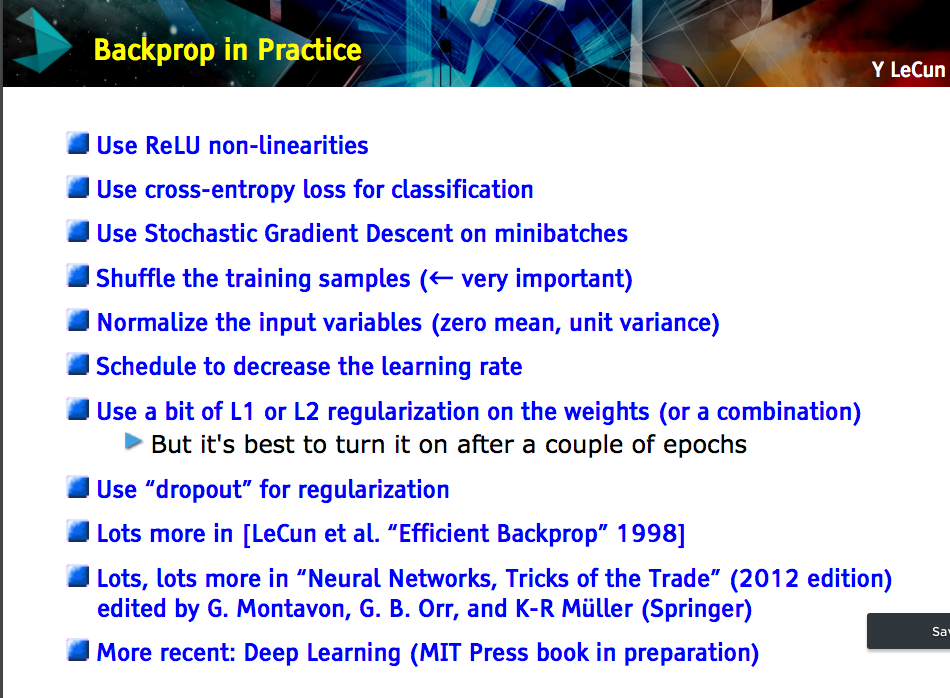
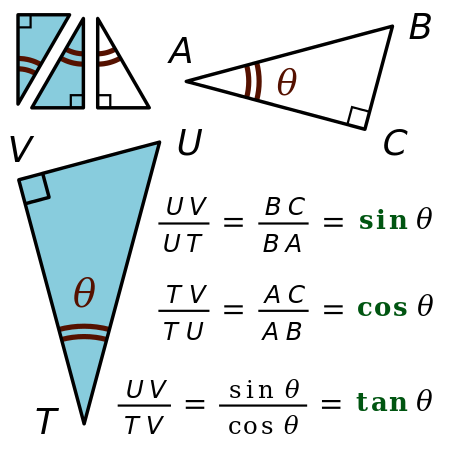
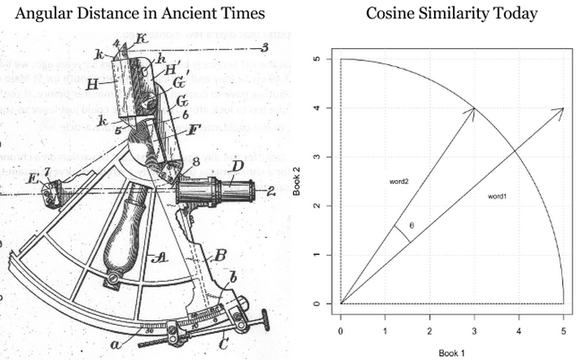
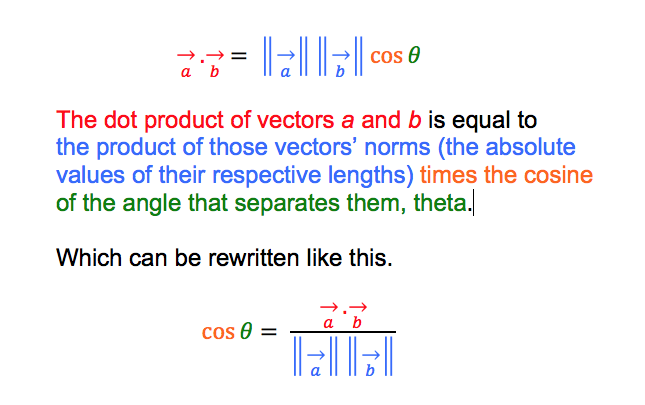
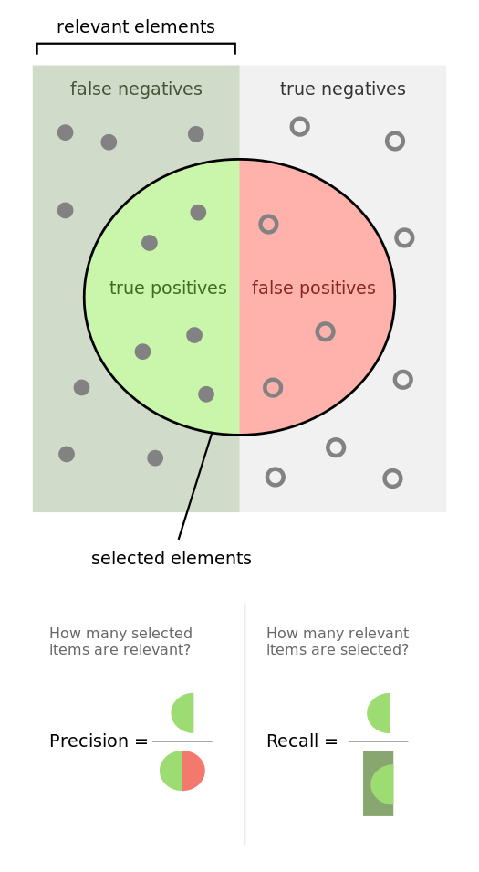
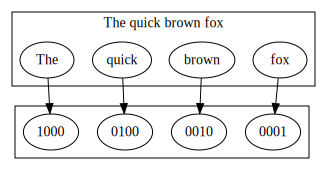
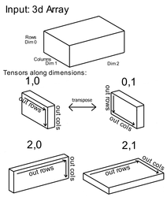
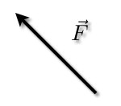
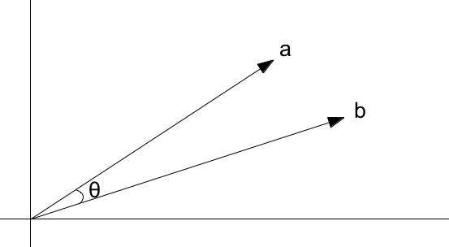

# Deep Learning and Neural Network Glossary

The intent of this glossary is to provide clear definitions of the technical terms specific to deep artificial neural networks. It is a work in progress.

### <a name="activation">Activation</a> 

An activation, or activation function, for a neural network is defined as the mapping of the input to the output via a [non-linear transform function](#nonlineartransformfunction) at each "node", which is simply a locus of computation within the net. Each layer in a neural net consists of many nodes, and the number of nodes in a layer is known as its width. 

Activation algorithms are the gates that determine, at each node in the net, whether and to what extent to transmit the signal the node has received from the previous layer. A combination of weights (coefficients) and biases work on the input data from the previous layer to determine whether that signal surpasses a given treshhold and is deemed significant. Those weights and biases are slowly updated as the neural net minimizes its error; i.e. the level of nodes' activation change in the course of learning. Deeplearning4j includes activation functions such as sigmoid, relu, tanh and ELU. These activation functions allow neural networks to make complex boundary decisions for features at various levels of abstraction. 

<!-- 
## Tom Hanlon commented this out May 2017, the link was broken, I had no time to track down what it pointed to
* [Activation Visualizer in Deeplearning4j](http://deeplearning4j.org/doc/org/deeplearning4j/plot/iterationlistener/ActivationMeanIterationListener.html)

-->

### <a name="adadelta">Adadelta</a> 
Adadelta is an updater, or learning algorithm, related to gradient descent. Unlike SGD, which applies the same learning rate to all parameters of the network, Adadelta adapts the learning rate per parameter. 

* [AdaDeltaUpdater in Deepelearning4j](http://deeplearning4j.org/doc/org/deeplearning4j/nn/updater/AdaDeltaUpdater.html)
* [ADADELTA: An Adaptive Learning Rate Method](http://arxiv.org/abs/1212.5701)

### <a name="adagrad">Adagrad</a>
Adagrad, short for adaptive gradient, is an updater or learning algorithm that adjust the learning rate for each parameter in the net by monitoring the squared gradients in the course of learning. It is a substitute for SGD, and can be useful when processing sparse data.

* [AdaGradUpdater in Deeplearning4j](http://deeplearning4j.org/doc/org/deeplearning4j/nn/updater/AdaGradUpdater.html)
* [Adaptive Subgradient Methods for Online Learning and Stochastic Optimization](http://www.magicbroom.info/Papers/DuchiHaSi10.pdf)

### <a name="adam">Adam</a>
Adam (Gibson) co-created Deeplearning4j. :) Adam is also an updater, similar to rmsprop, which uses a running average of the gradient's first and second moment plus a bias-correction term.

* [AdamUpdater in Deeplearning4j](http://deeplearning4j.org/doc/org/deeplearning4j/nn/updater/AdamUpdater.html)
* [Adam: A Method for Stochastic Optimization](http://arxiv.org/abs/1412.6980)

### <a name="affine">Affine Layer</a>
Affine is a fancy word for a fully connected layer in a neural network. "Fully connected" means that all the nodes of one layer connect to all the nodes of the subsequent layer. A restricted Boltzmann machine, for example, is a fully connected layer. Convolutional networks use affine layers interspersed with both their namesake convolutional layers (which create feature maps based on convolutions) and downsampling layers, which throw out a lot of data and only keep the maximum value. "Affine" derives from the Latin `affinis`, which means bordering or connected with. Each connection, in an affine layer, is a passage whereby input is multiplied by a weight and added to a bias before it accumulates with all other inputs at a given node, the sum of which is then passed through an activation function: e.g. `output = activation(weight*input+bias)`, or `y = f(w*x+b)`.

### <a name="alex">AlexNet</a>
AlexNet is a deep convolutional network named after Alex Krizhevsky, a former student of Geoff Hinton's at the University of Toronto, now at Google. AlexNet was used to win ILSVRC 2012, and foretold a wave of deep convolutional networks that would set new records in image recognition. AlexNet is now a standard architecture: it contains five convolutional layers, three of which are followed by max-pooling (downsampling) layers, two fully connected (affine) layers -- all of which ends in a softmax layer. Here is [Deeplearning4j's implementation of AlexNet](https://github.com/deeplearning4j/ImageNet-Example/blob/master/src/main/java/imagenet/Models/AlexNet.java).

* [AlexNet Example in Deeplearning4j](https://github.com/deeplearning4j/ImageNet-Example/blob/master/src/main/java/imagenet/Models/AlexNet.java)
* [ImageNet Classification with Deep Convolutional Neural Networks](http://papers.nips.cc/paper/4824-imagenet-classification-with-deep-convolutional-neural-networks.pdf)

### <a name="attention">Attention Models</a> 

Attention models "attend" to specific parts of an image in sequence, one after another. By relying on a sequence of glances, they capture visual structure, much like the human eye is believed to function with foveation. This visual processing, which relies on a recurrent network to process sequential data, can be contrasted with other machine vision techniques that process a whole image in a single, forward pass. 

* [DRAW: A Recurrent Neural Network For Image Generation](http://arxiv.org/abs/1502.04623).

### <a name="backprop">Autoencoder</a>
Autoencoders are at the heart of representation learning. They encode input, usually by compressing large vectors into smaller vectors that capture their most significant features; that is, they are useful for data compression (dimensionality reduction) as well as data reconstruction for unsupervised learning. A restricted Boltzmann machine is a type of autoencoder, and in fact, autoencoders come in many flavors, including Variational Autoencoders, Denoising Autoencoders and Sequence Autoencoders. Variational autoencoders have replaced RBMs in many labs because they produce more stable results. Denoising autoencoders provide a form of regularization by introducing Gaussian noise into the input, which the network learns to ignore in search of the true signal. 

* [Autoencoder in Deeplearning4j](http://deeplearning4j.org/doc/org/deeplearning4j/nn/layers/feedforward/autoencoder/AutoEncoder.html)
* [Auto-Encoding Variational Bayes](http://arxiv.org/abs/1312.6114)
* [Stacked Denoising Autoencoders: Learning Useful Representations in a Deep Network with a Local Denoising Criterion](http://www.jmlr.org/papers/volume11/vincent10a/vincent10a.pdf)
* [Semi-supervised Sequence Learning](http://arxiv.org/abs/1511.01432)
* [Autoencoder in Deeplearning4j](https://github.com/deeplearning4j/dl4j-examples/blob/master/src/main/java/org/deeplearning4j/examples/autoencoder/StackedAutoEncoderMnistExample.java)

### <a name="backprop">Backpropagation</a> 
To calculate the [gradient](#gradient) the relate weights to error, we use a technique known as backpropagation, which is also referred to as the backward pass of the network. Backpropagation is a repeated application of chain rule of calculus for partial
derivatives. The first step is to calculate the derivatives of the objective function with respect to the output units, then the derivatives of the output of the last hidden layer to the input of the last hidden layer; then the input of the last hidden layer to the weights between it and the penultimate hidden layer, etc. Here's a [derivation of backpropagation](http://web.cs.swarthmore.edu/~meeden/cs81/s10/BackPropDeriv.pdf). And here's [Yann LeCun's important paper](http://yann.lecun.com/exdb/publis/pdf/lecun-88.pdf) on the subject.

A special form of backpropagation is called backpropagation through time, or BPTT, which is specifically useful for recurrent networks analyzing text and time series. With BPTT, each time step of the RNN is the equivalent of a layer in a feed-forward network. To backpropagate over many time steps, BPTT can be truncated for the purpose of efficiency. Truncated BPTT limits the time steps over which error is propagated.

* [Backpropagation Types in Deeplearningtj](http://deeplearning4j.org/doc/org/deeplearning4j/nn/conf/BackpropType.html)
* [Backpropagation Through Time: What It Does and How to Do It](http://deeplearning.cs.cmu.edu/pdfs/Werbos.backprop.pdf)

### <a name="batch">Batch Normalization</a> 

Batch Normalization does what is says: it normalizes mini-batches as they're fed into a neural-net layer. Batch normalization has two potential benefits: it can accelerate learning because it allows you to employ higher learning rates, and also regularizes that learning.

* [Batch Normalization in Deeplearning4j](http://deeplearning4j.org/doc/org/deeplearning4j/nn/layers/normalization/BatchNormalization.html)
* [Batch Normalization: Accelerating Deep Network Training by Reducing Internal Covariate Shift](http://arxiv.org/abs/1502.03167)
* [Overview	of mini-batch gradient descent (U. Toronto)](http://www.cs.toronto.edu/~tijmen/csc321/slides/lecture_slides_lec6.pdf)

### <a name="bayes">Bayes Theorem</a> 
Bayes’ Theorem is *a mathematical framework for integrating new evidence with prior beliefs.* For example, suppose you’re sitting in your quiet suburban home and you hear something that sounds like a lion roaring. You have some prior beliefs that lions are unlikely to be near your house, so you figure that it’s probably not a lion. Probably it’s some weird machine of your neighbor’s that just happens to sound like a lion, or some kids pranking you by playing lion noises, or something. You end up believing that there’s probably no lion nearby, but you do have a slightly higher probability of there being a lion nearby than you had before you heard the roaring noise. Bayes’ Theorem is just this kind of reasoning converted to math. [source](http://slatestarcodex.com/2016/09/12/its-bayes-all-the-way-up/)

* [Bayes Rules: A Theoretical Guide](https://arbital.com/p/bayes_rule/?l=1zq)

### <a name="bidirectional">Bidirectional Recurrent Neural Networks</a> 
A Bidirectional RNN is composed of two RNNs that process data in opposite directions. One reads a given sequence from start to finish; the other reads it from finish to start. Bidirectional RNNs are employed in NLP for translation problems, among other use cases. Deeplearning4j's implementation of [bidirectional Graves LSTMs is here](https://github.com/deeplearning4j/deeplearning4j/blob/master/deeplearning4j-core/src/main/java/org/deeplearning4j/nn/layers/recurrent/GravesBidirectionalLSTM.java).

* [Bidirectional Recurrent Neural Networks](http://www.di.ufpe.br/~fnj/RNA/bibliografia/BRNN.pdf)

### <a name="binarization">Binarization</a> 
The process of transforming data in to a set of zeros and ones. An example would be gray-scaling an image by transforming a picture from the 0-255 spectrum to a 0-1 spectrum. 

### <a name="boltzmann">Boltzmann Machine</a> 
"A Boltzmann machine learns internal (not defined by the user) concepts that help to explain (that can generate) the observed data. These concepts are captured by random variables (called hidden units) that have a joint distribution (statistical dependencies) among themselves and with the data, and that allow the learner to capture highly non-linear and complex interactions between the parts (observed random variables) of any observed example (like the pixels in an image). You can also think of these higher-level factors or hidden units as another, more abstract, representation of the data. The Boltzmann machine is parametrized through simple two-way interactions between every pair of random variable involved (the observed ones as well as the hidden ones)." - [Yoshua Bengio](https://www.quora.com/What-is-an-intuitive-explanation-of-a-Boltzmann-machine)

### <a name="channel">Channel</a>
Channel is a word used when speaking of convolutional networks. ConvNets treat color images as volumes; that is, an image has height, width and depth. The depth is the number of channels, which coincide with how you encode colors. RGB images have three channels, for red, green and blue respectively.

### <a name="class">Class</a>
Used in classification a Class refers to a label applied to a group of records sharing similar characteristics. 

### <a name="confusionmatrix">Confusion Matrix</a>
Also known as an error matrix or contingency table. Confusions matrices allow you to see if your algorithm is systematically confusing two labels, by contrasting your net's predictions against a benchmark.

### <a name="contrastivedivergence">Contrastive Divergence</a>
"[Contrastive divergence](http://www.robots.ox.ac.uk/~ojw/files/NotesOnCD.pdf) is a recipe for training undirected [graphical models](#graphicalmodels) (a class of probabilistic models used in machine learning). It relies on an approximation of the [gradient](#gradient) (a good direction of change for the parameters) of the [log-likelihood](#loglikelihood) (the basic criterion that most probabilistic learning algorithms try to optimize) based on a short Markov chain (a way to sample from probabilistic models) started at the last example seen. It has been popularized in the context of Restricted Boltzmann Machines (Hinton & Salakhutdinov, 2006, Science), the latter being the first and most popular building block for deep learning algorithms." ~[*Yoshua Bengio*](http://www.quora.com/What-is-contrastive-divergence)

### <a name="convolution">Convolutional Network (CNN)</a>
[Convolutional networks](./convolutionalnets.html) are a deep neural network that is currently the state-of-the-art in image processing. They are setting new records in accuracy every year on widely accepted benchmark contests like ImageNet. 

From the Latin *convolvere*, “to convolve” means to roll together. For mathematical purposes, a convolution is the integral measuring how much two functions overlap as one passes over the other. Think of a convolution as a way of mixing two functions by multiplying them: a fancy form of multiplication.

Imagine a tall, narrow bell curve standing in the middle of a graph. The integral is the area under that curve. Imagine near it a second bell curve that is shorter and wider, drifting slowly from the left side of the graph to the right. The product of those two functions’ overlap at each point along the x-axis is their convolution. So in a sense, the two functions are being “rolled together.”

### <a name="cosine">Cosine Similarity</a>

It turns out two vectors are just 66% of a triangle, so let's do a quick trig review. 

Trigonometric functions like *sine*, *cosine* and *tangent* are ratios that use the lengths of a side of a right triangle (opposite, adjacent and hypotenuse) to compute the shape’s angles. By feeding the sides into ratios like these 

we can also know the angles at which those sides intersect. Remember [SOH-CAH-TOA](http://mathworld.wolfram.com/SOHCAHTOA.html)?

Differences between word vectors, as they swing around the origin like the arms of a clock, can be thought of as differences in degrees. 

And similar to ancient navigators gauging the stars by a sextant, we will measure the *angular distance* between words using something called *cosine similarity*. You can think of words as points of light in a dark canopy, clustered together in constellations of meaning. 

To find that distance knowing only the word vectors, we need the equation for vector dot multiplication (multiplying two vectors to produce a single, scalar value). 

In Java, you can think of the formula to measure cosine similarity like this:

    public static double cosineSimilarity(double[] vectorA, double[] vectorB) {
        double dotProduct = 0.0;
        double normA = 0.0;
        double normB = 0.0;
        for (int i = 0; i < vectorA.length; i++) {
            dotProduct += vectorA[i] * vectorB[i];
            normA += Math.pow(vectorA[i], 2);
            normB += Math.pow(vectorB[i], 2);
        }   
        return dotProduct / (Math.sqrt(normA) * Math.sqrt(normB));
    }

Cosine is the angle attached to the origin, which makes it useful here. (We normalize the measurements so they come out as percentages, where 1 means that two vectors are equal, and 0 means they are perpendicular, bearing no relation to each other.) 

### <a name="parallel">Data Parallelism and Model Parallelism</a>

Training a neural network on a very large dataset requires some form of parallelism, of which there are two types: data parallelism and model parallelism. 

Deeplearning4j does **data parallelism**. 

Let's say you have a very large image dataset of 1,000,000 faces. Those faces can be divided into batches of 10, and then 10 separate batches can be dispatched simultaneously to 10 different convolutional networks, so that 100 instances can be processed at once. The 10 different CNNs would then train on a batch, calculate the error on that batch, and update their parameters based on that error. Then, using parameter averaging, the 10 CNNs would update a central, master CNN that would take the average of their updated paramters. This process would repeat until the entire dataset has been exhausted. For more information, please see our page on [iterative reduce](http://deeplearning4j.org/iterativereduce). 

**Model parallelism** is another way to accelerate neural net training on very large datasets. Here, instead of sending batches of faces to separate neural networks, let's imagine a different kind of image: an enormous map of the earth. Model parallelism would divide that enormous map into regions, and it would park a separate CNN on each region, to train on only that area and no other. Then, as each enormous map was peeled off the dataset to train the neural networks, it would be broken up and different patches of it would be sent to train on separate CNNs. No parameter averaging necessary here. 

### <a name="datascience">Data Science</a>

[Data science](http://www.inferentialthinking.com/chapter1/intro.html) is the discipline of drawing conclusions from data using computation. There are three core aspects of effective data analysis: exploration, prediction, and inference. 

### <a name="dbn">Deep-Belief Network (DBN)</a>

A deep-belief network is a stack of [restricted Boltzmann machines](#rbm), which are themselves a feed-forward autoencoder that learns to reconstruct input layer by layer, greedily. Pioneered by Geoff Hinton and crew. Because a DBN is deep, it learns a hierarchical representation of input. Because DBNs learn to reconstruct that data, they can be useful in unsupervised learning. 

* [A fast learning algorithm for deep belief nets](https://www.cs.toronto.edu/~hinton/absps/fastnc.pdf)

### <a name="deeplearning">Deep Learning</a>

    Deep Learning allows computational models composed of multiple processing layers to learn representations of data with multiple levels of abstraction.  These methods have dramatically improved the state-of-the-art in speech recognition, visual object recognition, object detection, and many other domains such as drug discovery and genomics. Deep learning discovers intricate structure in large datasets by using the back-propagation algorithm to indicate how a machine should change its internal parameters that are used to compute the representation in each layer from the representation in the previous layer.  Deep convolutional nets have brought about dramatic improvements in processing images, video, speech and audio, while recurrent nets have shone on sequential data such as text and speech.  Representation learning is a set of methods that allows a machine to be fed with raw data and to automatically discover the representations needed for detection or classification. Deep learning methods are representation learning methods with multiple levels of representation, obtained by composing simple but non-linear modules that each transform the representation at one level (starting with the raw input) into a representation at a higher, slightly more abstract level.
    
-*NIPS*

### <a name="distributed">Distributed Representations</a>

The Nupic community has a good explanation of distributed representations [here](https://github.com/numenta/nupic/wiki/Sparse-Distributed-Representations). Other good explanations can be found on this [Quora page](https://www.quora.com/Deep-Learning/What-is-meant-by-a-distributed-representation).

### <a name="downpoursgd">Downpour Stochastic Gradient Descent</a>
[Downpour stochastic gradient descent](http://research.google.com/archive/large_deep_networks_nips2012.html) is an asynchronous [stochastic gradient descent](#stochasticgradientdescent) procedure, employed by Google among others, that expands the scale and increases the speed of training deep-learning networks. 

### <a name="dropout">Dropout</a>
Dropout is a hyperparameter used for regularization in neural networks. Like all regularization techniques, its purpose is to prevent overfitting. Dropout randomly makes nodes in the neural network "drop out" by setting them to zero, which encourages the network to rely on other features that act as signals. That, in turn, creates more generalizable representations of data. 

* [Dropout: A Simple Way to Prevent Neural Networks from Overfitting](https://www.cs.toronto.edu/~hinton/absps/JMLRdropout.pdf)
* [Recurrent Neural Network Regularization](http://arxiv.org/abs/1409.2329)

### <a name="dropconnect">DropConnect</a>
DropConnect is a generalization of Dropout for regularizing large fully-connected layers within neural networks. Dropout sets a randomly selected subset of activations to zero at each layer. DropConnect, in contrast, sets a randomly selected subset of weights within the network to zero.

* [Regularization of Neural Networks using DropConnect](http://www.matthewzeiler.com/pubs/icml2013/icml2013.pdf)

### <a name="embedding">Embedding</a>
An embedding is a representation of input, or an encoding. For example, a neural word embedding is a vector that represents that word. The word is said to be embedded in vector space. Word2vec and GloVe are two techniques used to train word embeddings to predict a word's context. Because an embedding is a form of representation learning, we can "embed" any data type, including sounds, images and time series. 

### <a name="epoch">Epoch vs. Iteration</a>

In machine-learning parlance, an epoch is a complete pass through a given dataset. That is, by the end of one epoch, your neural network -- be it a restricted Boltzmann machine, convolutional net or deep-belief network -- will have been exposed to every record to example within the dataset once. Not to be confused with an iteration, which is simply one update of the neural net model's parameters. Many iterations can occur before an epoch is over. Epoch and iteration are only synonymous if you update your parameters once for each pass through the whole dataset; if you update using mini-batches, they mean different things. Say your data has 2 minibatches: A and B. `.numIterations(3)` performs training like AAABBB, while 3 epochs looks like ABABAB.

### <a name="etl">Extract, transform, load (ETL)</a>
Data is loaded from disk or other sources into memory with the proper transforms such as [binarization](#binarization) and [normalization](#normalization). Broadly, you can think of a datapipeline as the process over gathering data from disparate sources and locations, putting it into a form that your algorithms can learn from, and then placing it in a data structure that they can iterate through. 

### <a name="f1">f1 Score</a>
The f1 score is a number between zero and one that explains how well the network performed during training. It is analogous to a percentage, with 1 being the best score and zero the worst. f1 is basically the probability that your net’s guesses are correct.

    F1 = 2 * ((precision * recall) / (precision + recall))

Accuracy measures how often you get the right answer, while f1 scores are a measure of accuracy. For example, if you have 100 fruit -- 99 apples and 1 orange -- and your model predicts that all 100 items are apples, then it is 99% accurate. But that model failed to identify the difference between apples and oranges. f1 scores help you judge whether a model is actually doing well as classifying when you have an imbalance in the categories you're trying to tag.

An f1 score is an average of both precision and recall. More specifically, it is a type of average called the harmonic mean, which tends to be less than the arithmetic or geometric means. Recall answers: "Given a positive example, how likely is the classifier going to detect it?" It is the ratio of true positives to the sum of true positives and false negatives.

Precision answers: "Given a positive prediction from the classifier, how likely is it to be correct ?" It is the ratio of true positives to the sum of true positives and false positives.

For f1 to be high, both recall and precision of the model have to be high. 

 

### <a name="feedforward">Feed-Forward Network</a>
A neural network that takes the initial input and triggers the [activation](#activation) of each layer of the network successively, without circulating. Feed-forward nets contrast with recurrent and recursive nets in that feed-forward nets never let the output of one node circle back to the same or previous nodes.

### <a name="gaussian">Gaussian Distribution</a>
A Gaussian, or [normal](https://en.wikipedia.org/wiki/Normal_distribution), distribution, is a continuous probability distribution that represents the probability that any given observation will occur on different points of a range. Visually, it resembles what's usually called a Bell curve. 

### <a name="glove">Gloval Vectores (GloVe)</a>
GloVe is a generalization of Tomas Mikolov's word2vec algorithms, a technique for creating neural word embeddings. It was first presented at NIPS by Jeffrey Pennington, Richard Socher and Christopher Manning of Stanford's NLP department. [Deeplearning4j's implementation of GloVe is here](https://github.com/deeplearning4j/dl4j-examples/blob/master/src/main/java/org/deeplearning4j/examples/glove/GloVeExample.java). 

* [GloVe: Global Vectors for Word Representation](http://nlp.stanford.edu/pubs/glove.pdf)

### <a name="gradient">Gradient Descent</a>

The gradient is a derivative, which you will know from [differential calculus](https://en.wikipedia.org/wiki/Differential_calculus). That is, it's the ratio of the rate of change of a neural net's parameters and the error it produces, as it learns how to reconstruct a dataset or make guesses about labels. The process of minimizing error is called [gradient descent](https://en.wikipedia.org/wiki/Gradient_descent). Descending a gradient has two aspects: choosing the direction to step in (momentum) and choosing the size of the step (learning rate). 

        Since MLPs are, by construction, differentiable operators, they can be trained to minimise any differentiable objective function using gradient descent. The basic idea of gradient descent is to find the derivative of the objective function with respect to each of the network weights, then adjust the weights in the direction of the negative slope. -Graves

### <a name="clipping">Gradient Clipping</a>
Gradient Clipping is one way to solve the problem of exploding gradients. Exploding gradients arise in deep networks when gradients associating weights and the net's error become too large. Exploding gradients are frequently encountered in RNNs dealing with long-term dependencies. One way to clip gradients is to normalize them when the L2 norm of a parameter vector surpasses a given threshhold.

### <a name="epoch">Epoch</a>
An Epoch is a complete pass through all the training data. A neural network is trained until the error rate is acceptable, and this will often take multiple passes through the complete data set. 

*note* An iteration is when parameters are updated and is typically less than a full pass. For example if BatchSize is 100 and data size is 1,000 an epoch will have 10 iterations. If trained for 30 epochs there will be 300 iterations. 

### <a name="graphicalmodels">Graphical Models</a>
A directed graphical model is another name for a [Bayesian net](https://en.wikipedia.org/wiki/Bayesian_network), which represents the probabilistic relationships between the variables represented by its nodes.

### <a name="graphicalmodels">Gated Recurrent Unit (GRU)</a>
A GRU is a pared-down LSTM. GRUs rely on gating mechanisms to learn long-range dependencies while sidestepping the [vanishing gradient problem](#vanish). They include reset and update gates to decide when to update the GRUs memory at each time step.

* [Learning Phrase Representations using RNN Encoder-Decoder for Statistical Machine Translation](http://arxiv.org/abs/1406.1078v3)

### <a name="highway">Highway Networks</a>
Highway networks are an architecture introduced by Schmidhuber et al to let information flow unhindered across several RNN layers on so-called "information highways." The architecture uses gating units that learn to regulate the flow of information through the net. Highway networks with hundreds of layers can be trained directly using SGD, which means they can support very deep architectures.

* [Highway Networks](http://arxiv.org/abs/1505.00387)

### <a name="hyperplane">Hyperplane</a>

"A hyperplane in an n-dimensional Euclidean space is a flat, n-1 dimensional subset of that space that divides the space into two disconnected parts. What does that mean intuitively? 

First think of the real line. Now pick a point. That point divides the real line into two parts (the part above that point, and the part below that point). The real line has 1 dimension, while the point has 0 dimensions. So a point is a hyperplane of the real line.

Now think of the two-dimensional plane. Now pick any line. That line divides the plane into two parts ("left" and "right" or maybe "above" and "below"). The plane has 2 dimensions, but the line has only one. So a line is a hyperplane of the 2d plane. Notice that if you pick a point, it doesn't divide the 2d plane into two parts. So one point is not enough.

Now think of a 3d space. Now to divide the space into two parts, you need a plane. Your plane has two dimensions, your space has three. So a plane is the hyperplane for a 3d space.

OK, now we've run out of visual examples. But suppose you have a space of n dimensions. You can write down an equation describing an n-1 dimensional object that divides the n-dimensional space into two pieces. That's a hyperplane." -[Quora](https://www.quora.com/Support-Vector-Machines-What-is-an-intuitive-explanation-of-hyperplane/answer/Jerrod-Ankenman?srid=OfW)

### <a name="iclr">International Conference on Learning Representations</a>

ICLR, pronounced "I-clear". An important conference. See [representation learning](#represent).

### <a name="icml">International Conference for Machine Learning</a>
ICML, or the International Conference for Machine Learning, is a well-known and well attended machine-learning conference. 

### <a name="ILSVRC">ImageNet Large Scale Visual Recognition Challenge  (ILSVRC)</a>
The ImageNet Large Scale Visual Recognition Challenge is the formal name for ImageNet, a yearly contest held to solicit and evalute the best techniques in image recognition. Deep convolutional architectures have driven error rates on the ImageNet competition from 30% to less than 5%, which means they now have human-level accuracy. 

### <a name="iteration">Iteration</a>
An iteration is an update of weights after analysing a batch of input records. See Epoch for clarification.   

### <a name="lenet">LeNet</a>
Google's LeNet architecture is a deep convolutional network. It won ILSVRC in 2014, and introduced techniques for paring the size of a CNN, thus increasing computational efficiency. 

* [Going Deeper with Convolutions](http://arxiv.org/abs/1409.4842)

### <a name="lstm">Long Short-Term Memory Units (LSTM)</a>
LSTMs are a form of recurrent neural network invented in the 1990s by Sepp Hochreiter and Juergen Schmidhuber, and now widely used for image, sound and time series analysis, because they help solve the vanishing gradient problem by using a memory gates. Alex Graves made significant improvements to the LSTM with what is now known as the Graves LSTM, which [Deeplearning4j implements here](https://github.com/deeplearning4j/dl4j-examples/tree/master/src/main/java/org/deeplearning4j/examples/rnn). 

* [LSTMs with Deeplearning4j](./lstm.html)
* [Using RNNs with Deeplearning4j](./usingrnns.html)
* [Original Paper: LONG SHORT-TERM MEMORY](http://deeplearning.cs.cmu.edu/pdfs/Hochreiter97_lstm.pdf)

### <a name="loglikelihood">Log-Likelihood</a>
Log likelihood is related to the statistical idea of the [likelihood function](https://en.wikipedia.org/wiki/Likelihood_function#Log-likelihood). Likelihood is a function of the parameters of a statistical model. "The probability of some observed outcomes given a set of parameter values is referred to as the [likelihood](https://www.princeton.edu/~achaney/tmve/wiki100k/docs/Likelihood_function.html) of the set of parameter values given the observed outcomes."

### <a name="mle">Maximum Likelihood Estimation</a>

"Say you have a coin and you're not sure it's "fair." So you want to estimate the "true" probability it will come up heads. Call this probability P, and code the outcome of a coin flip as 1 if it's heads and 0 if it's tails.
You flip the coin four times and get 1, 0, 0, 0 (i.e., 1 heads and 3 tails). What is the likelihood that you would get these outcomes, given P? Well, the probability of heads is P, as we defined it above. That means the probability of tails is (1 - P). So the probability of 1 heads and 3 tails is P * (1 - P)3 [Edit: We call this the "likelihood" of the data].
If we "guess" that the coin is fair, that's saying P = 0.5, so the likelihood of the data is L = .5 * (1 - .5)3 = .0625.
What if we guess that P = 0.45? Then L = .45 * (1 - .45)3 = ~.075. So P = 0.45 is actually a better estimate than P = 0.5, because the data are "more likely" to have occurred if P = 0.45 than if P = 0.5.
At P = 0.4, the likelihood is 0.4 * (1 - 0.4)3 = .0864.
At P = 0.35, the likelihood is 0.35 * (1 - 0.35)3 = .096.
In this case, it turns out that the value of P that maximizes the likelihood is P = 0.25. So that's our "maximum likelihood" estimate for P.
In practice, max likelihood is harder to estimate than this (with predictors and various assumptions about the distribution of the data and error terms), but that's the basic concept behind it." *--[u/jacknbox](https://www.reddit.com/r/AskStatistics/comments/4mpl9q/eli5_maximum_likelihood_and_reml/d3y3zaw/)*

So in a sense, probability is treated as an unseen, internal property of the data. A parameter. And likelihood is a measure of how well the outcomes recorded in the data match our hypothesis about their probability; i.e. our theory about how the data is produced. The better our theory of the data's probability, the higher the likelihood of a given set of outcomes. 

### <a name="model">Model</a>
In neural networks, the model is the collection of weights and biases that transform input into output. A neural network is a set of algorithms that update models such that the models guess with less error as they learn. A model is a symbolic, logical or mathematical machine whose purpose is to deduce output from input. If a model's assumptions are correct, then one must necessarily believe its conclusions. Neural networks produced trained models that can be deployed to process, classify, cluster and make predictions about data. 

### <a name="mnist">MNIST</a>
MNIST is the "hello world" of deep-learning datasets. Everyone uses MNIST to test their neural networks, just to see if the net actually works at all. MNIST contains 60,000 training examples and 10,000 test examples of the handwritten numerals 0-9. These images are 28x28 pixels, which means they require 784 nodes on the first input layer of a neural network. MNIST is [available for download here](http://yann.lecun.com/exdb/mnist/). Here is an example of [training a DBN on MNIST](http://deeplearning4j.org/deepbeliefnetwork.html) with Deeplearning4j. 

### <a name="model score">Model Score</a>
As your model trains the goal of training is to improve the "score" for the output or the overall error rate. The webui will present a graph of the score for each iteration. For text based console output of the score as the model trains you would use [ScoreIterationListener](http://deeplearning4j.org/doc/org/deeplearning4j/optimize/listeners/ScoreIterationListener.html)

### <a name="momentum">Nesterov's Momentum</a>
Momentum also known as Nesterov’s momentum, influences the speed of learning. It causes the model to converge faster to a point of minimal error. Momentum adjusts the size of the next step, the weight update, based on the previous step’s gradient. That is, it takes the gradient’s history and multiplies it. Before each new step, a provisional gradient is calculated by taking partial derivatives from the model, and the hyperparameters are applied to it to produce a new gradient. Momentum influences the gradient your model uses for the next step.

* [Nesterov's Momentum Updater in Deeplearnign4j](https://github.com/deeplearning4j/deeplearning4j/blob/b585d6c1ae75e48e06db86880a5acd22593d3889/deeplearning4j-core/src/main/java/org/deeplearning4j/nn/updater/NesterovsUpdater.java)

### <a name="mlp">Multilayer Perceptron</a>
MLPs are perhaps the oldest form of deep neural network. They consist of multiple, fully connected feedforward layers. Examples of [Deeplearning4j's multilayer perceptrons can be seen here](https://github.com/deeplearning4j/dl4j-examples/tree/master/src/main/java/org/deeplearning4j/examples/mlp). 

### <a name="nmt">Neural Machine Translation</a>
Neural machine translation maps one language to another using neural networks. Typically, recurrent neural networks are use to ingest a sequence from the input language and output a sequence in the target language. 

* [Sequence to Sequence Learning with Neural Networks](http://arxiv.org/abs/1409.3215)

### <a name="nce">Noise-Contrastive Estimations (NCE)</a>  

Noise-contrastive estimation offers a balance of computational and statistical efficiency. It is used to train classifiers with many classes in the output layer. It replaces the softmax probability density function, an approximation of a maximum likelihood estimator that is cheaper computationally. 

* [Noise-contrastive estimation: A new estimation principle for unnormalized statistical models](http://www.jmlr.org/proceedings/papers/v9/gutmann10a/gutmann10a.pdf)
* [Learning word embeddings efficiently with noise-contrastive estimation](http://papers.nips.cc/paper/5165-learning-word-embeddings-efficiently-with-noise-contrastive-estimation.pdf)

### <a name="nonlineartransformfunction">Nonlinear Transform Function</a>  
A function that maps input on a nonlinear scale such as [sigmoid](http://en.wikipedia.org/wiki/Sigmoid_function) or [tanh](http://en.wikipedia.org/wiki/Hyperbolic_function). By definition, a nonlinear function's output is not directly proportional to its input.

### <a name="normalization">Normalization</a> 
The process of transforming the data to span a range from 0 to 1. 

### <a name="OOP">Object-Oriented Programming (OOP)</a> 
While deep learning and opject oriented programming don't necessarily go together, Deeplearning4j is written in Java following the principles of OOP. In object-oriented programming, you create so-called objects, which are generally abstract nouns representing a part in a larger symbolic machine (e.g. in Deeplearning4j, the object class DataSetIterator traverses across datasets and feeds parts of those datasets into another process, iteratively, piece by piece). 

DatasetIterator is actually the name of a class of object. In any particular object-oriented program, you would create a particular instance of that general class, calling it, say, 'iter' like this: 

        new DataSetIterator iter;

Every object is really just a data structure that combines fields containing data and methods that act on the data in those fields. 

The way you talk about those fields and methods is with the dot operator `.`, and parentheses `()` that contain parameters. For example, if you wrote `iter.next(5)`, then you'd be telling the DataSetIterator to go across a dataset processing 5 instances of that data (say 5 images or records) at a time, where `next` is the method you call, and 5 is the parameter you pass into it.

You can learn more about DataSetIterator and other classes in Deeplearning4j in our [Javadoc](./doc/).

### <a name="objectivefunction">Objective Function</a> 
Also called a loss function or a cost function, an objective function defines what success looks like when an algorithm learns. It is a measure of the difference between a neural net's guess and the ground truth; that is, the error. Measuring that error is a precondition to updating the neural net in such a way that its guesses generate less error. The error resulting from the loss function is fed into backpropagation in order to update the weights and biases that process input in the neural network. 

### <a name="hot">One-Hot Encoding</a> 
Used in classification and bag of words. The label for each example is all 0s, except for a 1 at the index of the actual class to which the example belongs. For BOW, the one represents the word encountered. 

Below is an example of one-hot encoding for the phrase "The quick brown fox" 

### <a name="pooling">Pooling</a> 
Pooling, max pooling and average pooling are terms that refer to downsampling or subsampling within a convolutional network. Downsampling is a way of reducing the amount of data flowing through the network, and therefore decreasing the computational cost of the network. Average pooling takes the average of several values. Max pooling takes the greatest of several values. Max pooling is currently the preferred type of downsampling layer in convolutional networks. 

### <a name="density">Probability Density</a> 
Probability densities are used in unsupervised learning, with algorithms such as autoencoders, VAEs and GANs.

"A probability density essentially says "for a given variable (e.g. radius) what, at that particular value, is the likelihood of encountering an event or an object (e.g. an electron)?" So if I'm at the nucleus of a atom and I move to, say, one Angstrom away, at one Angstrom there is a certain likelihood I will spot an electron. But we like to not just ask for the probability at one point; we'd sometimes like to find the probability for a range of points: What is the probability of finding an electron between the nucleus and one Angstrom, for example. So we add up ("integrate") the probability from zero to one Angstrom. For the sake of convenience, we sometimes employ "normalization"; that is, we require that adding up all the probabilities over every possible value will give us 1.00000000 (etc)." *[--u/beigebox](https://www.reddit.com/r/explainlikeimfive/comments/yy7tv/eli5_probability_density_function/)*

### <a name="distribution">Probability Distribution</a> 

"A probability distribution is a mathematical function and/or graph that tells us how likely something is to happen.

So, for example, if you're rolling two dice and you want to find the likelihood of each possible number you can get, you could make a [chart that looks like this](https://upload.wikimedia.org/wikipedia/commons/1/12/Dice_Distribution_%28bar%29.svg). As you can see, you're most likely to get a 7, then a 6, then an 8, and so on. The numbers on the left are the percent of the time where you'll get that value, and the ones on the right are a fraction (they mean the same thing, just different forms of the same number). The way that it you use the distribution to find the likelihood of each outcome is this:

There are 36 possible ways for the two dice to land. There are 6 combinations that get you 7, 5 that get you 6/8, 4 that get you 5/9, and so on. So, the likelihood of each one happening is the number of possible combinations that get you that number divided by the total number of possible combinations.
For 7, it would be 6/36, or 1/6, which you'll notice is the same as what we see in the graph. For 8, it's 5/36, etc. etc.

The key thing to note here is that the sum of all of the probabilities will equal 1 (or, 100%). That's really important, because it's absolutely essential that there be a result of rolling the two die every time. If all the percentages added up to 90%, what the heck is happening that last 10% of the time?

So, for more complex probability distributions, the way that the distribution is generated is more involved, but the way you read it is the same. If, for example, you see a [distribution that looks like this](https://upload.wikimedia.org/wikipedia/commons/8/8c/Standard_deviation_diagram.svg), you know that you're going to get a value of μ 40% (corresponding to .4 on the left side) of the time whenever you do whatever the experiment or test associated with that distribution.

The percentages in the shaded areas are also important. Just like earlier when I said that the sum of all the probabilities has to equal 1 or 100%, the area under the curve of a probability distribution has to equal 1, too. You don't need to know why that is (it involves calculus), but it's worth mentioning. You can see that the graph I linked is actually helpfully labeled; the reason they do that is to show you that you what percentage of the time you're going to end up somewhere in that area.

So, for example, about 68% of the time, you'll end up between -1σ and 1σ." *[--u/corpuscle634](https://www.reddit.com/r/explainlikeimfive/comments/1aglls/eli5_probability_distributions/)*

### <a name="reconstructionentropy">Reconstruction Entropy</a> 
After applying Gaussian noise, a kind of statistical white noise, to the data, this [objective function](#objectivefunction) punishes the network for any result that is not closer to the original input. That signal prompts the network to learn different features in an attempt to reconstruct the input better and minimize error. 

### <a name="relu">Rectified Linear Units</a> 
Rectified linear units, or reLU, are a non-linear activation function widely applied in neural networks because they deal well with the vanishing gradient problem. They can be expressed so: `f(x) = max(0, x)`, where activation is set to zero if the output does not surpass a minimum threshhold, and activation increases linearly above that threshhold. 

* [Rectifier Nonlinearities Improve Neural Network Acoustic Models](https://web.stanford.edu/~awni/papers/relu_hybrid_icml2013_final.pdf)
* [Delving Deep into Rectifiers: Surpassing Human-Level Performance on ImageNet Classification](http://arxiv.org/abs/1502.01852)
* [Rectified Linear Units Improve Restricted Boltzmann Machines](http://www.cs.toronto.edu/~fritz/absps/reluICML.pdf)
* [Incorporating Second-Order Functional Knowledge for Better Option Pricing](http://papers.nips.cc/paper/1920-incorporating-second-order-functional-knowledge-for-better-option-pricing.pdf)

### <a name="recurrent">Recurrent Neural Networks</a> 
While "a multilayer perceptron (MLP) can only map from input to output vectors, whereas an RNN can in principle map from the entire history of previous inputs to each output. Indeed, the equivalent result to the universal approximation theory for MLPs is that an RNN with a sufficient number of hidden units can approximate any measurable sequence-to-sequence mapping to arbitrary accuracy (Hammer, 2000). The key point is that the recurrent connections allow a ‘memory’ of previous inputs to persist in the network’s internal state, which can then be used to influence the network output. The forward pass of an RNN is the same as that of an MLP with a single hidden layer, except that activations arrive at the hidden layer from both the current external input and the hidden layer activations one step back in time. " -Graves

### <a name="recursive">Recursive Neural Networks</a> 

Recursive neural networks learn data with structural hierarchies, such as text arranged grammatically, much like recurrent neural networks learn data structured by its occurance in time. Their chief use is in natural-language processing, and they are associated with Richard Socher of Stanford's NLP lab.

* [Recursive Deep Models for Semantic Compositionality Over a Sentiment Treebank](http://nlp.stanford.edu/~socherr/EMNLP2013_RNTN.pdf)

### <a name="reinforcement">Reinforcement Learning</a> 

Reinforcement learning is a branch of machine learning that is goal oriented; that is, reinforcement learning algorithms have as their objective to maximize a reward, often over the course of many decisions. Unlike deep neural networks, reinforcement learning is not differentiable. 

### <a name="representation">Representation Learning</a> 

Representation learning is learning the best representation of input. A vector, for example, can "represent" an image. Training a neural network will adjust the vector's elements to represent the image better, or lead to better guesses when a neural network is fed the image. The neural net might train to guess the image's name, for instance. Deep learning means that several layers of representations are stacked atop one another, and those representations are increasingly abstract; i.e. the initial, low-level representations are granular, and may represent pixels, while the higher representations will stand for combinations of pixels, and then combinations of combinations, and so forth. 

### <a name="resnet">Residual Networks (ResNet)</a> 
Microsoft Research used deep Residual Networks to win ImageNet in 2015. ResNets create "shortcuts" across several layers (deep resnets have 150 layers), allowing the net to learn so-called residual mappings. ResNets are similar to nets with Highway Layers, although they're data independent. Microsoft Research created ResNets by generating by [different deep networks automatically and relying on hyperparameter optimization](http://www.wired.com/2016/01/microsoft-neural-net-shows-deep-learning-can-get-way-deeper/). 

* [Deep Residual Learning for Image Recognition](http://arxiv.org/abs/1512.03385)

### <a name="rbm">Restricted Boltzmann Machine (RBM)</a> 
Restricted Boltzmann machines are Boltzmann machines that are constrained to feed input forward symmetrically, which means all the nodes of one layer must connect to all the nodes of the subsequent layer. Stacked RBMs are known as a deep-belief network, and are used to learn how to reconstruct data layer by layer. Introduced by Geoff Hinton, RBMs were partially responsible for the renewed interest in deep learning that began circa 2006. In many labs, they have been replaced with more stable layers such as Variational Autoencoders. 

* [A Practical Guide to Training Restricted Boltzmann Machines](https://www.cs.toronto.edu/~hinton/absps/guideTR.pdf)

### <a name="rmsprop">RMSProp</a> 
RMSProp is an optimization algorithm like Adagrad. In contrast to Adagrad, it relies on a decay term to prevent the learning rate from decreasing too rapidly.

* [RMSPropUpdater in Deeplearning4j](https://github.com/deeplearning4j/deeplearning4j/blob/b585d6c1ae75e48e06db86880a5acd22593d3889/deeplearning4j-core/src/main/java/org/deeplearning4j/nn/updater/RmsPropUpdater.java)
* [Optimization Algorithms (Stanford)](https://cs231n.github.io/neural-networks-3/)
* [An overview of gradient descent optimization algorithms](http://sebastianruder.com/optimizing-gradient-descent/)

### <a name="score">Score</a>
Measurement of the overall error rate of the model. The score of the model will be displayed graphically in the webui or it can be displayed the console by using [ScoreIterationListener](http://deeplearning4j.org/doc/org/deeplearning4j/optimize/listeners/ScoreIterationListener.html) 

### <a name="serialization">Serialization</a> 
Serialization is how you translate data structures or object state into storable formats. Deeplearning4j's nets are serialized, which means they can operate on devices with limited memory.

### <a name="skipgram">Skipgram</a> 
The prerequisite to a definition of skipgrams is one of ngrams. [An n-gram is a contiguous sequence of n items from a given sequence of text or speech.](https://en.wikipedia.org/wiki/N-gram) A unigram represents one "item," a bigram two, a trigram three and so forth. Skipgrams are ngrams in which the items are not necessarily contiguous. This can be illustrated best with [a few examples.](http://homepages.inf.ed.ac.uk/ballison/pdf/lrec_skipgrams.pdf) Skipping is a form of noise, in the sense of [noising and denoising](http://deeplearning4j.org/stackeddenoisingautoencoder.html), which allows neural nets to better generalize their extraction of features. See how skipgrams are implemented in [Word2vec](./word2vec.html).

### <a name="softmax">Softmax</a> 
Softmax is a function used as the output layer of a neural network that classifies input. It converts vectors into class probabilities. Softmax normalizes the vector of scores by first exponentiating and then dividing by a constant. 

* [A Scalable Hierarchical Distributed Language Model](https://www.cs.toronto.edu/~amnih/papers/hlbl_final.pdf)

### <a name="stochasticgradientdescent">Stochastic Gradient Descent</a>
[Stochastic Gradient Descent](https://en.wikipedia.org/wiki/Stochastic_gradient_descent) optimizes gradient descent and minimizes the loss function during network training. 

*Stochastic* is simply a synonym for "random." A stochastic process is a process that involves a random variable, such as randomly initialized weights. Stochastic derives from the Greek word *stochazesthai*, "to guess or aim at". Stochastic processes describe the evolution of, say, a random set of variables, and as such, they involve some indeterminacy -- quite the opposite of having a precisely predicted processes that are deterministic, and have just one outcome. 

The stochastic element of a learning process is a form of search. Random weights represent a hypothesis, an attempt, or a guess that one tests. The results of that search are recorded in the form of a weight adjustment, which effectively shrinks the search space as the parameters move toward a position of less error.  

Neural-network gradients are calculated using backpropagation. SGD is usually used with minibatches, such that parameters are updated  based on the average error generated by the instances of a whole batch.

* [SGDUpdater in Deeplearning4j](https://github.com/deeplearning4j/deeplearning4j/blob/b585d6c1ae75e48e06db86880a5acd22593d3889/deeplearning4j-core/src/main/java/org/deeplearning4j/nn/updater/SgdUpdater.java)

### <a name="svm">Support Vector Machine</a>

While support-vector machines are not neural networks, they are an important algorithm that [deserves explanation](https://www.reddit.com/r/MachineLearning/comments/15zrpp/please_explain_support_vector_machines_svm_like_i/): 

    An SVM is just trying to draw a line through your training points. So it's just like regular old linear regression except for the following three details: (1) there is an epsilon parameter that means "If the line fits a point to within epsilon then that's good enough; stop trying to fit it and worry about fitting other points." (2) there is a C parameter and the smaller you make it the more you are telling it to find "non-wiggly lines". So if you run SVR and get some crazy wiggly output that's obviously not right you can often make C smaller and it will stop being crazy. And finally (3) when there are outliers (e.g. bad points that will never fit your line) in your data they will only mess up your result a little bit. This is because SVR only gets upset about outliers in proportion to how far away they are from the line it wants to fit. This is contrasted with normal linear regression which gets upset in proportion to the square of the distance from the line. Regular linear regression worries too much about these bad points. TL;DR: SVR is trying to draw a line that gets within epsilon of all the points. Some points are bad and can't be made to get within epsilon and SVR doesn't get too upset about them whereas other regression methods flip out.

- [Reddit](https://www.reddit.com/r/MachineLearning/comments/2uynqa/please_explain_support_vector_regression_like_im/)

### <a name="tensors">Tensors</a>

Here is an example of tensor along dimension (TAD):

### <a name="vanish">Vanishing Gradient Problem</a>
The vanishing gradient problem is a challenge the confront backpropagation over many layers. Backpropagation establishes the relationship between a given weight and the error of a neural network. It does so through the chain rule of calculus, calculating how the change in a given weight along a gradient affects the change in error. However, in very deep neural networks, the gradient that relates the weight change to the error change can become very small. So small that updates in the net's parameters hardly change the net's guesses and error; so small, in fact, that it is difficult to know in which direction the weight should be adjusted to diminish error. Non-linear activation functions such as sigmoid and tanh make the vanishing gradient problem particularly difficult, because the activation funcion tapers off at both ends. This has led to the widespread adoption of rectified linear units (reLU) for activations in deep nets. It was in seeking to solve the vanishing gradient problem that Sepp Hochreiter and Juergen Schmidhuber invented a form of recurrent network called an LSTM in the 1990s. The inverse of the vanishing gradient problem, in which the gradient is impossibly small, is the exploding gradient problem, in which the gradient is impossibly large (i.e. changing a weight has too much impact on the error.)

* [On the difficulty of training recurrent neural networks](http://www.jmlr.org/proceedings/papers/v28/pascanu13.pdf)

### <a name="transfer">Transfer Learning</a>

Transfer learning is when a system can recognize and apply knowledge and skills learned in previous domains or tasks to novel domains or tasks. That is, if a model is trained on image data to recognize one set of categories, transfer learning applies if that same model is capable, with minimal additional training, or recognizing a different set of categories. For example, trained on 1,000 celebrity faces, a transfer learning model can be taught to recognize members of your family by swapping in another output layer with the nodes "mom", "dad", "elder brother", "younger sister" and training that output layer on the new classifications. 

### <a name="vectors">Vector</a>

[Word2vec](./word2vec.html) and other neural networks represent input as vectors.

A vector is a data structure with at least two components, as opposed to a *scalar*, which has just one. For example, a vector can represent velocity, an idea that combines speed and direction: *wind velocity* = (50mph, 35 degrees North East). A scalar, on the other hand, can represent something with one value like temperature or height: 50 degrees Celsius, 180 centimeters.

Therefore, we can represent two-dimensional vectors as arrows on an x-y graph, with the coordinates x and y each representing one of the vector's values. 

Two vectors can relate to one another mathematically, and similarities between them (and therefore between anything you can vectorize, including words) can be measured with precision. 

As you can see, these vectors differ from one another in both their length, or magnitude, and in their angle, or direction. The angle is what concerns us here. 

### <a name="vgg">VGG</a>
VGG is a deep convolutional architecture that won the benchmark ImageNet competition in 2014. A VGG architecture is composed of 16–19 weight layers and uses small convolutional filters. [Deeplearning4j's implementations of two VGG architectures are here](https://github.com/deeplearning4j/deeplearning4j/tree/master/deeplearning4j-zoo/src/main/java/org/deeplearning4j/zoo/model).

* [Very Deep Convolutional Networks for Large-Scale Image Recognition](http://arxiv.org/abs/1409.1556)

### <a name="word2vec">Word2vec</a>
Tomas Mikolov's neural networks, known as Word2vec, have become widely used because they help produce state-of-the-art word embeddings. Word2vec is a two-layer neural net that processes text. Its input is a text corpus and its output is a set of vectors: feature vectors for words in that corpus. While Word2vec is not a deep neural network, it turns text into a numerical form that deep nets can understand. Word2vec’s applications extend beyond parsing sentences in the wild. It can be applied just as well to genes, code, playlists, social media graphs and other verbal or symbolic series in which patterns may be discerned. Deeplearning4j implements a distributed form of Word2vec for Java and Scala, which works on Spark with GPUs.

* [Word2vec in Deeplearning4j](./word2vec.html)

### <a name="xavier">Xavier Initialization</a>

The Xavier initialization is based on the work of Xavier Glorot and Yoshua Bengio in their paper "[Understanding the difficulty of training deep feedforward neural networks](http://jmlr.org/proceedings/papers/v9/glorot10a/glorot10a.pdf)." An explanation can be found [here](http://andyljones.tumblr.com/post/110998971763/an-explanation-of-xavier-initialization). Weights should be initialized in a way that promotes "learning". The wrong weight initialization will make gradients too large or too small, and make it difficult to update the weights. Small weights lead to small activations, and large weights lead to large ones. Xavier weight initialization considers the distribution of output activations with regard to input activations. Its purpose is to maintain same distribution of activations, so they aren't too small (mean zero but with small variance) or too large (mean zero but with large variance). DL4J's implementation of Xavier weight initialization aligns with the Glorot Bengio paper, `Nd4j.randn(order, shape).muli(FastMath.sqrt(2.0 / (fanIn + fanOut)))`. Where `fanIn(k)` would be the number of units sending input to k, and  `fanOut(k)` would be the number of units recieving output from k.

