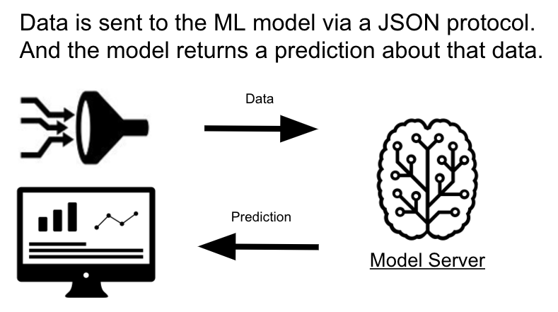

# Model Server for Machine Learning and AI

Deeplearning4j serves machine-learning models for inference in production using the free developer edition of SKIL, the [Skymind Intelligence Layer](https://skymind.ai/products). 

A model server serves the parametric machine-learning models that makes decisions about data. It is used for the inference stage of a machine-learning workflow, after data pipelines and model training. A model server is the tool that allows data science research to be deployed in a real-world production environment.

What a Web server is to the Internet, [a model server is to AI](https://docs.google.com/presentation/d/1psNOQ3ZpPFeak2zsjO5EgUS-ypoFeyw-3eiLNvyEZzg/edit?usp=sharing). Where a Web server receives an HTTP request and returns data about a Web site, a model server receives data, and returns a decision or prediction about that data: e.g. sent an image, a model server might return a label for that image, identifying faces or animals in photographs.

The SKIL model server is able to import models from Python frameworks such as Tensorflow, Keras, Theano and CNTK, overcoming a major barrier in deploying deep learning models to production environments.

Production-grade model servers have a few important features. They should be:

* Secure. They may process sensitive data. 
* Scalable. That data traffic may surge, and predictions should be made with low latency.
* Stable and debuggable. SKIL is based on the enterprise-hardened JVM.
* Certified. Deeplearning4j works with CDH and HDP.
