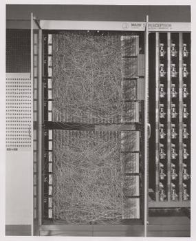
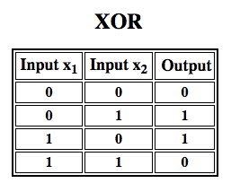

# A Beginner's Guide to Multilayer Perceptrons

* <a href="#code">Just Show Me the Code</a>
* <a href="#footnote">FootNotes</a>
* <a href="#reading">Further Reading</a>

The perceptron, that neural network whose name evokes how the future looked in the 1950s, is a simple algorithm intended to perform binary classification; i.e. it predicts whether input belongs to a certain category of interest or not: `fraud` or `not_fraud`, `cat` or `not_cat`. 

The perceptron holds a special place in the history of neural networks and artificial intelligence, because the initial hype about its performance led to a [rebuttal by Minsky and Papert](https://drive.google.com/file/d/1UsoYSWypNjRth-Xs81FsoyqWDSdnhjIB/view?usp=sharing), and wider spread backlash that cast a pall on neural network research for decades, a neural net winter that wholly thawed only with Geoff Hinton's research in the 2000s, the results of which have since swept the machine-learning community. 

Frank Rosenblatt, godfather of the perceptron, popularized it as a device rather than an algorithm. The perceptron first entered the world as hardware.<sup>[1](#one)</sup> Rosenblatt, a psychologist who studied and later lectured at Cornell University, received funding from the U.S. Office of Naval Research to build a machine that could learn. His machine, the Mark I perceptron, looked like this. 



<p align="center">
<a href="https://docs.skymind.ai/docs/welcome" type="button" class="btn btn-lg btn-success" onClick="ga('send', 'event', ‘quickstart', 'click');">GET STARTED WITH PERCEPTRONS</a>
</p>

A perceptron is a linear classifier; that is, it is an algorithm that classifies input by separating two categories with a straight line. Input is typically a feature vector `x` multiplied by weights `w` and added to a bias `b`: `y = w * x + b`. 

A perceptron produces a single output based on several real-valued inputs by forming a linear combination using its input weights (and sometimes passing the output through a nonlinear activation function). Here's how you can write that in math:


where **w** denotes the vector of weights, **x** is the vector of inputs, **b** is the bias and phi is the non-linear activation function.

Rosenblatt built a single-layer perceptron. That is, his hardware-algorithm did not include multiple layers, which allow neural networks to model a feature hierarchy. It was, therefore, a shallow neural network, which prevented his perceptron from performing non-linear classification, such as the XOR function (an XOR operator trigger when input exhibits either one trait or another, but not both; it stands for "exclusive OR"), as Minsky and Papert showed in their book. 



## Multilayer Perceptrons (MLP)

Subsequent work with multilayer perceptrons has shown that they are capable of approximating an XOR operator as well as many other non-linear functions. 

Just as Rosenblatt based the perceptron on the McCulloch-Pitts neuron, conceived in 1943, so too, perceptrons themselves are building blocks that only prove to be useful in these larger functions called multilayer perceptrons. 

The multilayer perceptron is the hello world of deep learning: a good place to start when you are learning about deep learning. 

A multilayer perceptron (MLP) is a [deep, artificial neural network](./neuralnet-overview). It is composed of more than one perceptron. They are composed of an input layer to receive the signal, an output layer that makes a decision or prediction about the input, and in between those two, an arbitrary number of hidden layers that are the true computational engine of the MLP. MLPs with one hidden layer are capable of approximating any continuous function. 

Multilayer perceptrons are often applied to supervised learning problems<sup>[2](#two)</sup>: they train on a set of input-output pairs and learn to model the correlation (or dependencies) between those inputs and outputs. Training involves adjusting the parameters, or the weights and biases, of the model in order to minimize error. Backpropagation is used to make those weigh and bias adjustments relative to the error, and the error itself can be measured in a variety of ways, including by root mean squared error (RMSE).

Feedforward networks like MLPs are like tennis, or ping pong. They are mainly involved in two motions, a constant back and forth. 

In the *forward pass*, the signal flow moves from the input layer through the hidden layers to the output layer, and the decision of the output layer is measured against the ground truth labels. 

In the *backward pass*, using backpropagation and the chain rule of calculus, partial derivatives of the error function w.r.t. the various weights and biases are back-propagated through the MLP. That act of differentiation gives us a gradient, or a landscape of error, along which the parameters may be adjusted as they move the MLP one step closer to the error minimum. This can be done with any gradient-based optimisation algorithm such as stochastic gradient descent. The network keeps playing that game of tennis until the error can go no lower. This state is known as *convergence*.

## <a name="code">Just Show Me the Code</a>

Eclipse Deeplearning4j includes [several examples of multilayer perceptrons](https://github.com/deeplearning4j/dl4j-examples/tree/master/dl4j-examples/src/main/java/org/deeplearning4j/examples/feedforward/classification), or MLPs, which rely on so-called dense layers. 

```
        MultiLayerConfiguration conf = new NeuralNetConfiguration.Builder()
                .seed(seed)
                .iterations(1)
                .optimizationAlgo(OptimizationAlgorithm.STOCHASTIC_GRADIENT_DESCENT)
                .learningRate(learningRate)
                .updater(Updater.NESTEROVS)     //To configure: .updater(new Nesterovs(0.9))
                .list()
                .layer(0, new DenseLayer.Builder().nIn(numInputs).nOut(numHiddenNodes)
                        .weightInit(WeightInit.XAVIER)
                        .activation(Activation.RELU)
                        .build())
                .layer(1, new OutputLayer.Builder(LossFunction.NEGATIVELOGLIKELIHOOD)
                        .weightInit(WeightInit.XAVIER)
                        .activation(Activation.SOFTMAX).weightInit(WeightInit.XAVIER)
                        .nIn(numHiddenNodes).nOut(numOutputs).build())
                .pretrain(false).backprop(true).build();
```

[In Keras](https://keras.io/getting-started/sequential-model-guide/), you would use `SequentialModel` to create a linear stack of layers:

```
from keras.models import Sequential
from keras.layers import Dense, Activation

model = Sequential([
    Dense(32, input_shape=(784,)),
    Activation('relu'),
    Dense(10),
    Activation('softmax'),
])
```

## <a name="footnote">Footnotes</a>

<a name="one">1)</a> *The interesting thing to point out here is that software and hardware exist on a flowchart: software can be expressed as hardware and vice versa. When chips such as FPGAs are programmed, or ASICs are constructed to bake a certain algorithm into silicon, we are simply implementing software one level down to make it work faster. Likewise, what is baked in silicon or wired together with lights and potentiometers, like Rosenblatt's Mark I, can also be expressed symbolically in code. This is why Alan Kay has said "People who are really serious about software should make their own hardware." But there's no free lunch; i.e. what you gain in speed by baking algorithms into silicon, you lose in flexibility, and vice versa. This happens to be a real problem with regards to machine learning, since the algorithms alter themselves through exposure to data. The challenge is to find those parts of the algorithm that remain stable even as parameters change; e.g. the linear algebra operations that are currently processed most quickly by GPUs.*  

<a name="two">2)</a> *They are widely used at Google, which is probably the most sophisticated AI company in the world, for a wide array of tasks crucial to its ad business, despite the existence of more complex, state-of-the-art methods.* 

## <a name="reading">Further Reading</a>

* [The Perceptron: A Probabilistic Model for Information Storage and Organization in the Brain, Cornell Aeronautical Laboratory, Psychological Review, by Frank Rosenblatt, 1958 (PDF)](http://citeseerx.ist.psu.edu/viewdoc/download?doi=10.1.1.335.3398&rep=rep1&type=pdf)
* [A Logical Calculus of Ideas Immanent in Nervous Activity, W. S. McCulloch & Walter Pitts, 1943](http://www.cs.cmu.edu/~./epxing/Class/10715/reading/McCulloch.and.Pitts.pdf)
* [Perceptrons: An Introduction to Computational Geometry, by Marvin Minsky & Seymour Papert](https://drive.google.com/file/d/1UsoYSWypNjRth-Xs81FsoyqWDSdnhjIB/view?usp=sharing)
* [Multi-Layer Perceptrons (MLP)](http://users.ics.aalto.fi/ahonkela/dippa/node41.html) 

### <a name="beginner">Other Machine Learning Tutorials</a>
* [Introduction to Neural Networks](./neuralnet-overview)
* [Deep Reinforcement Learning](./deepreinforcementlearning)
* [Symbolic AI and Deep Learning](./symbolicreasoning)
* [Using Graph Data with Deep Learning](./graphdata)
* [Recurrent Networks and LSTMs](./lstm)
* [Word2Vec: Neural Embeddings for NLP](./word2vec)
* [Restricted Boltzmann Machines](./restrictedboltzmannmachine)
* [Eigenvectors, Covariance, PCA and Entropy](./eigenvector)
* [Neural Networks & Regression](./logistic-regression)
* [Convolutional Networks (CNNs)](./convolutionalnets)
* [Open Datasets for Deep Learning](./opendata)
* [Inference: Machine Learning Model Server](./modelserver)
